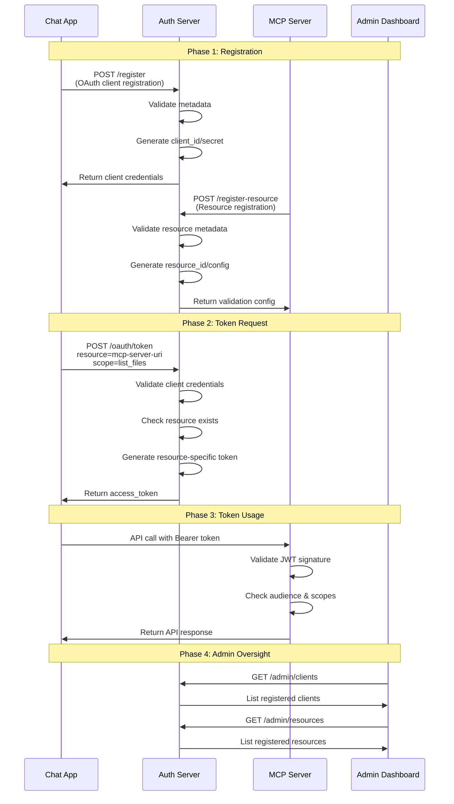

# Dynamic Registration Requirements

## Overview

This document outlines the requirements for implementing dynamic OAuth client registration (RFC 7591) and protected resource registration in our authentication system. Unlike traditional OAuth flows where each service registers itself, our system has a unique pattern where the **Chat App requests tokens for MCP Servers**.

## Current System Architecture

### OAuth Actors in Our System

1. **Chat App** (`chat-app`)
   - **Role**: OAuth client that requests tokens
   - **Needs**: Client credentials to request tokens for various MCP servers
   - **Current State**: Statically registered

2. **MCP Server** (`mcp-server`)
   - **Role**: Protected resource that validates tokens
   - **Needs**: Resource registration to be known by auth server
   - **Current State**: Statically configured

3. **Auth Server**
   - **Role**: Authorization server that issues and validates tokens
   - **Needs**: Registration endpoints for both clients and resources

## Token Flow Pattern

Our system uses a **proxy token pattern** where:
- Chat App requests tokens **for** MCP servers
- MCP servers validate tokens but don't request them
- Auth server issues resource-specific tokens

```
Chat App → Auth Server: "Give me a token for MCP Server X"
Auth Server → Chat App: "Here's a token for MCP Server X"
Chat App → MCP Server X: "Here's your token"
```

## Registration Requirements

### 1. OAuth Client Registration (RFC 7591)

For applications that need to **request tokens** (like Chat App):

#### API Endpoint
```
POST /register
Content-Type: application/json
```

#### Request Format
```json
{
  "client_name": "File Management Chat App",
  "client_uri": "https://github.com/company/chat-app",
  "redirect_uris": ["http://localhost:5001/callback"],
  "token_endpoint_auth_method": "client_secret_basic",
  "grant_types": [
    "client_credentials", 
    "urn:ietf:params:oauth:grant-type:token-exchange"
  ],
  "response_types": ["token"],
  "scope": "mcp:token-request",
  "software_id": "chat-app",
  "software_version": "1.0.0"
}
```

#### Response Format
```json
{
  "client_id": "chat-app-abc123",
  "client_secret": "secret-xyz789",
  "client_id_issued_at": 1640995200,
  "client_secret_expires_at": 0,
  "token_endpoint_auth_method": "client_secret_basic",
  "grant_types": [
    "client_credentials",
    "urn:ietf:params:oauth:grant-type:token-exchange"
  ]
}
```

### 2. Protected Resource Registration (Custom)

For MCP servers that need to **validate tokens**:

#### API Endpoint
```
POST /register-resource
Content-Type: application/json
```

#### Request Format
```json
{
  "resource_name": "File Management MCP Server",
  "resource_uri": "http://localhost:9001",
  "resource_id": "file-mcp-server",
  "supported_scopes": ["list_files", "read_files", "write_files"],
  "token_validation_method": "jwt_shared_secret",
  "discovery_endpoint": "/.well-known/oauth-protected-resource",
  "health_check_endpoint": "/health",
  "software_id": "file-mcp-server",
  "software_version": "1.0.0"
}
```

#### Response Format
```json
{
  "resource_id": "file-mcp-server-def456",
  "resource_uri": "http://localhost:9001",
  "jwt_validation_secret": "shared-secret-abc123",
  "supported_scopes": ["list_files", "read_files", "write_files"],
  "token_audience": "http://localhost:9001",
  "registration_expires_at": 1640995200
}
```

## Complete Registration Flow



## Implementation Requirements

### 1. Database Schema Changes

#### New Tables
```sql
-- OAuth clients (enhanced)
CREATE TABLE oauth_clients (
    id INTEGER PRIMARY KEY AUTOINCREMENT,
    client_id TEXT UNIQUE NOT NULL,
    client_secret_hash TEXT NOT NULL,
    client_name TEXT,
    client_uri TEXT,
    client_type TEXT DEFAULT 'confidential',
    description TEXT,
    redirect_uris TEXT, -- JSON array
    grant_types TEXT, -- JSON array
    response_types TEXT, -- JSON array
    token_endpoint_auth_method TEXT DEFAULT 'client_secret_basic',
    software_id TEXT,
    software_version TEXT,
    token_exchange_enabled BOOLEAN DEFAULT TRUE,
    allowed_audiences TEXT, -- JSON array
    is_active BOOLEAN DEFAULT TRUE,
    created_at TIMESTAMP DEFAULT CURRENT_TIMESTAMP,
    updated_at TIMESTAMP DEFAULT CURRENT_TIMESTAMP,
    expires_at TIMESTAMP NULL
);

-- Protected resources (new)
CREATE TABLE protected_resources (
    id INTEGER PRIMARY KEY AUTOINCREMENT,
    resource_id TEXT UNIQUE NOT NULL,
    resource_name TEXT NOT NULL,
    resource_uri TEXT UNIQUE NOT NULL,
    supported_scopes TEXT, -- JSON array
    token_validation_method TEXT DEFAULT 'jwt_shared_secret',
    jwt_validation_secret TEXT,
    discovery_endpoint TEXT,
    health_check_endpoint TEXT,
    software_id TEXT,
    software_version TEXT,
    is_active BOOLEAN DEFAULT TRUE,
    created_at TIMESTAMP DEFAULT CURRENT_TIMESTAMP,
    updated_at TIMESTAMP DEFAULT CURRENT_TIMESTAMP,
    expires_at TIMESTAMP NULL
);
```

### 2. API Endpoints to Implement

#### OAuth Client Registration
- `POST /register` - RFC 7591 client registration
- `GET /register/{client_id}` - Get client configuration
- `PUT /register/{client_id}` - Update client configuration
- `DELETE /register/{client_id}` - Delete client

#### Protected Resource Registration
- `POST /register-resource` - Resource registration
- `GET /register-resource/{resource_id}` - Get resource configuration
- `PUT /register-resource/{resource_id}` - Update resource configuration
- `DELETE /register-resource/{resource_id}` - Delete resource

#### Enhanced Token Endpoint
- `POST /oauth/token` - Enhanced with `resource` parameter support

#### Admin Management
- `GET /admin/clients` - List all registered clients
- `GET /admin/resources` - List all registered resources
- `POST /admin/clients/{client_id}/revoke` - Revoke client
- `POST /admin/resources/{resource_id}/revoke` - Revoke resource

### 3. Token Endpoint Enhancement

The existing token endpoint needs to support the `resource` parameter (RFC 8707):

```python
@app.post("/oauth/token")
async def token_endpoint(
    grant_type: str = Form(...),
    client_id: str = Form(...),
    client_secret: str = Form(...),
    scope: str = Form(default=""),
    resource: Optional[str] = Form(default=None)  # New parameter
):
    # Validate client credentials
    # If resource parameter provided:
    #   - Validate resource exists
    #   - Generate resource-specific token
    #   - Set appropriate audience
    # Return JWT token
```

### 4. Validation Logic

#### Client Registration Validation
- Validate required fields
- Check redirect URI format
- Validate grant types
- Generate secure client credentials
- Store registration metadata

#### Resource Registration Validation
- Validate resource URI accessibility
- Check scope format
- Validate discovery endpoint
- Generate JWT validation secret
- Store resource metadata

#### Token Request Validation
- Validate client credentials
- Check resource parameter against registered resources
- Validate requested scopes against resource capabilities
- Generate resource-specific JWT with correct audience

### 5. Security Considerations

#### Client Registration Security
- Rate limiting on registration endpoints
- Client credential entropy requirements
- Optional registration access tokens
- Client metadata validation

#### Resource Registration Security
- Resource URI validation and reachability checks
- Scope validation against known patterns
- JWT secret generation and rotation
- Resource health monitoring

#### Token Security
- Resource-specific token audiences
- Scope validation against resource capabilities
- Token expiration and refresh policies
- Audit logging for all registrations

## Migration Strategy

### Phase 1: Database Schema
1. Add new tables for enhanced client and resource registration
2. Migrate existing clients to new schema
3. Add current MCP server as registered resource

### Phase 2: Registration Endpoints
1. Implement OAuth client registration (RFC 7591)
2. Implement protected resource registration
3. Add admin management endpoints

### Phase 3: Token Enhancement
1. Add resource parameter support to token endpoint
2. Implement resource-specific token generation
3. Update token validation logic

### Phase 4: Integration
1. Update chat app to use dynamic registration
2. Update MCP servers to register themselves
3. Add admin dashboard integration

## Testing Requirements

### Unit Tests
- Client registration validation
- Resource registration validation
- Token generation with resource parameter
- JWT validation with resource-specific audiences

### Integration Tests
- End-to-end registration flow
- Token request and validation flow
- Admin management operations
- Error handling and edge cases

### Security Tests
- Registration endpoint security
- Token security with resource parameter
- Access control validation
- Rate limiting and abuse prevention

## Success Criteria

1. **Dynamic Client Registration**: New chat applications can register themselves via RFC 7591
2. **Dynamic Resource Registration**: New MCP servers can register themselves as protected resources
3. **Resource-Specific Tokens**: Tokens are generated with appropriate audience for target resources
4. **Admin Oversight**: Administrators can manage all registered clients and resources
5. **Backward Compatibility**: Existing static registrations continue to work
6. **Security**: All registration and token flows maintain security best practices

## Future Enhancements

1. **Client Credential Rotation**: Automatic rotation of client secrets
2. **Resource Discovery**: Automatic discovery of MCP servers on network
3. **Federation**: Support for external authorization servers
4. **Advanced Scopes**: Hierarchical and conditional scope systems
5. **Monitoring**: Real-time monitoring of registered resources and clients