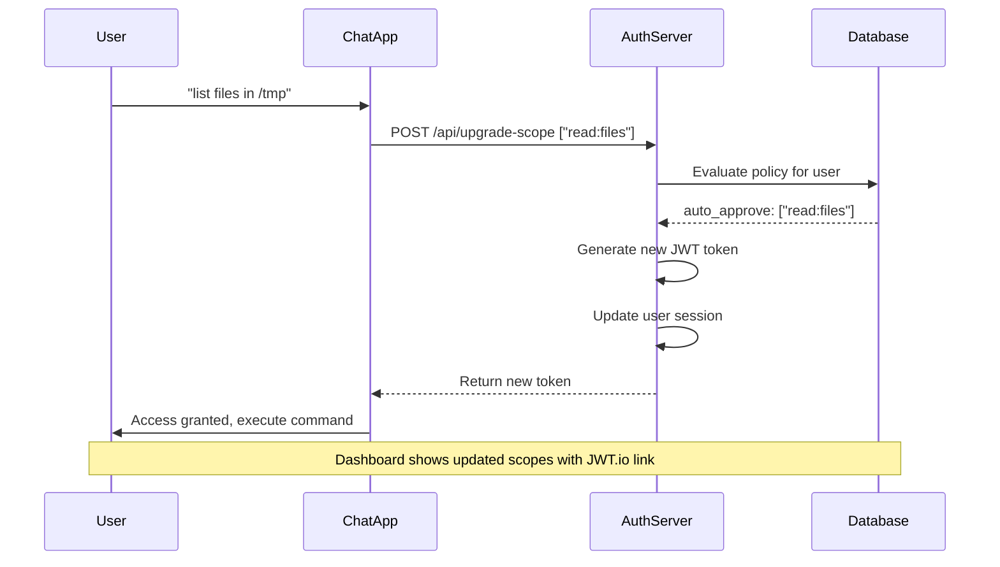

# 🔐 Unified Authentication & Authorization System

A production-ready authentication and authorization system implementing **RFC 8693 Token Exchange** with **database-driven approval policies** for MCP (Model Context Protocol) tools and AI agent interactions.

## 🌟 Key Features

### 🔒 **Enterprise-Grade Authentication**
- **Google OAuth 2.0** integration with JWT tokens
- **Asymmetric JWT (RS256)** and **Symmetric JWT (HS256)** support
- **Session-based** and **token-based** authentication
- **RFC 8693 Token Exchange** for scope upgrades
- **Cookie-based session management** with cross-port support

### 🛡️ **Database-Driven Authorization**
- **Configurable approval policies** (auto-approve, admin-required, role-required, always-deny)
- **Scope-based permissions** with real-time policy evaluation
- **Role-based access control** (admin/user roles)
- **Audit logging** for all authorization decisions

### 🔧 **MCP Tool Integration**
- **Secure tool access** with scope-based permissions
- **Real-time tool discovery** and access control
- **JWT.io debugging** links with public key integration
- **One-click public key copying** for JWT verification
- **Auto-approval workflows** for trusted operations

### 🎯 **Developer-Friendly**
- **One-command startup** with `./start_demo.sh`
- **Comprehensive cleanup** with `./cleanup_demo.sh`
- **Comprehensive logging** and error handling
- **Live token debugging** with JWT.io integration
- **Demo login** available without OAuth setup

## 🏗️ Architecture

```
┌─────────────────┐    ┌─────────────────┐    ┌─────────────────┐
│   Chat App      │    │   Auth Server   │    │   MCP Server    │
│   (Flask)       │◄──►│   (FastAPI +    │◄──►│   (FastMCP)     │
│   Port 5001     │    │   Database)     │    │   Port 8001     │
│                 │    │   Port 8002     │    │                 │
└─────────────────┘    └─────────────────┘    └─────────────────┘
         │                       │                       │
         └───────────────────────┼───────────────────────┘
                                 ▼
                    ┌─────────────────┐
                    │  Llama Stack    │
                    │  (AI Agents)    │
                    │  Port 8321      │
                    └─────────────────┘
```

### Components

1. **Auth Server** (`auth-server/unified_auth_server.py`)
   - FastAPI-based authentication server
   - SQLite database with configurable scope policies
   - JWT token generation and validation
   - Admin dashboard with JWT.io integration

2. **Chat App** (`frontend/chat_app.py`)
   - Flask web application with streaming responses
   - Google OAuth integration + demo login
   - Real-time chat with AI agents
   - Automatic scope upgrade requests

3. **MCP Server** (`mcp/mcp_server.py`)
   - FastMCP-based tool server
   - File system and command execution tools
   - Scope-based access control

4. **Database** (`auth-server/database.py`)
   - User management and role assignment
   - Configurable approval policies
   - Audit logging and session tracking

5. **Llama Stack** (`frontend/stack/run.yml`)
   - AI agent runtime with OpenAI GPT-4 integration
   - MCP tool integration for secure agent interactions
   - Requires `OPENAI_API_KEY` environment variable

## 🚀 Quick Start

### Prerequisites

```bash
# Python 3.11+ required
python --version

# Install dependencies
pip install -r requirements.txt
```

### Environment Setup

```bash
# Copy and configure environment
cp env.example .env

# Required: Set admin email
export ADMIN_EMAIL="your-admin@example.com"

# Required: OpenAI API Key (for GPT-4 model in run.yml)
export OPENAI_API_KEY="your-openai-api-key"

# Optional: JWT Mode (defaults to asymmetric)
export JWT_MODE="asymmetric"  # or "symmetric"

# Optional: Google OAuth (demo login available without)
export GOOGLE_CLIENT_ID="your-google-client-id"
export GOOGLE_CLIENT_SECRET="your-google-client-secret"
```

### Start the Demo

```bash
# Start all services with one command
./start_demo.sh

# Stop all services (preserves data)
./stop_demo.sh

# Complete cleanup (removes all data, keys, logs)
./cleanup_demo.sh
```

## 🎬 Demo Flow

### 1. **Access the System**
- **Chat Interface**: http://localhost:5001
- **Auth Dashboard**: http://localhost:8002/dashboard
- **Demo Login**: http://localhost:8002/auth/demo-login (if no Google OAuth)

### 2. **User Experience**
1. **Login** via Google OAuth or demo credentials
2. **Start with no permissions** (empty scope)
3. **Request file access**: "list files in /tmp"
4. **Auto-approved** for `read:files` scope
5. **Updated permissions** shown in dashboard with JWT.io link

### 3. **Admin Experience**
1. **Access admin dashboard** with admin account
2. **View pending approvals** for restricted operations
3. **Approve/deny requests** with audit logging
4. **Monitor user permissions** and policy evaluation

### 4. **JWT Token Debugging**
1. **Click JWT.io link** in dashboard (auto-includes token and public key)
2. **Copy public key** with one-click button for manual verification
3. **Inspect token contents** with real scopes and signatures
4. **Debug scope-based access control** with live token data

## 🔧 Configuration

### Database Policies

The system uses SQLite database with configurable approval policies:

```sql
-- Auto-approve read operations for all users
INSERT INTO scope_policies (scope, policy_type, target_roles) 
VALUES ('read:files', 'auto_approve', '["user", "admin"]');

-- Require admin approval for command execution
INSERT INTO scope_policies (scope, policy_type, target_roles) 
VALUES ('execute:commands', 'admin_required', '["user"]');

-- Role-required for admin operations
INSERT INTO scope_policies (scope, policy_type, target_roles) 
VALUES ('admin:users', 'role_required', '["admin"]');
```

### Environment Variables

```bash
# Server Configuration
AUTH_SERVER_URL="http://localhost:8002"
MCP_SERVER_URL="http://localhost:8001"
LLAMA_STACK_URL="http://localhost:8321"

# JWT Configuration
JWT_MODE="asymmetric"                    # "asymmetric" (RS256) or "symmetric" (HS256)
JWT_SECRET="your-jwt-secret"             # For symmetric mode only

# Authentication
GOOGLE_CLIENT_ID="your-client-id"
GOOGLE_CLIENT_SECRET="your-client-secret"

# Admin Setup
ADMIN_EMAIL="your-admin@example.com"

# OpenAI Integration
OPENAI_API_KEY="your-openai-api-key"      # Required for GPT-4 model in Llama Stack

# Database
DB_PATH="auth-server/auth.db"
```

## 🔐 JWT Modes

The system supports both symmetric and asymmetric JWT signing:

### **Asymmetric Mode (RS256) - Default**
- **Auto-generates RSA key pairs** on startup if not found
- **Public key distribution** via JWKS endpoint
- **Enhanced security** with public/private key separation
- **Production-ready** with industry-standard practices
- **One-click public key copying** in dashboard

```bash
# Enable asymmetric mode (default)
export JWT_MODE="asymmetric"

# Keys auto-generated at:
# - auth-server/keys/private_key.pem
# - auth-server/keys/public_key.pem  
# - auth-server/keys/jwks.json
```

### **Symmetric Mode (HS256)**
- **Shared secret** for signing and verification
- **Simpler deployment** for development environments
- **Requires JWT_SECRET** environment variable

```bash
# Enable symmetric mode
export JWT_MODE="symmetric"
export JWT_SECRET="your-secret-key"
```

## 🧹 Cleanup & Maintenance

### **Stop Services (Preserves Data)**
```bash
./stop_demo.sh
# Preserves: databases, keys, logs, user data
```

### **Complete Cleanup**
```bash
./cleanup_demo.sh
# Removes: all databases, JWT keys, logs, cache files
# Clears: browser cookies, kills processes
# Provides: confirmation prompts and verification
```

### **Fresh Start**
```bash
./cleanup_demo.sh && ./start_demo.sh
# Complete reset with new keys and clean databases
```

## 📁 Project Structure

```
Authentication/
├── auth-server/
│   ├── unified_auth_server.py      # Main auth server (FastAPI)
│   ├── database.py                 # Database models and operations
│   ├── generate_keys.py           # RSA key pair generation
│   ├── keys/                      # JWT keys (auto-generated)
│   │   ├── private_key.pem        # RSA private key
│   │   ├── public_key.pem         # RSA public key
│   │   └── jwks.json              # JSON Web Key Set
│   ├── init_admin.py              # Admin user initialization
│   └── auth.db                    # SQLite database
├── frontend/
│   ├── chat_app.py                # Flask chat application
│   └── templates/                 # HTML templates
├── mcp/
│   ├── mcp_server.py              # MCP tool server
│   └── README.md                  # MCP documentation
├── logs/                          # Application logs
├── start_demo.sh                  # One-command startup script
├── stop_demo.sh                   # Stop services (preserves data)
├── cleanup_demo.sh                # Complete cleanup script
└── requirements.txt               # Python dependencies
```

## 🔍 API Endpoints

### Auth Server (Port 8002)

```http
# Authentication
GET  /auth/login                   # Google OAuth login
GET  /auth/callback               # OAuth callback
GET  /auth/logout                 # Logout and cleanup
GET  /auth/demo-login            # Demo login (no OAuth required)

# Dashboard
GET  /dashboard                   # Admin/user dashboard with JWT.io links

# Token Exchange (RFC 8693)
POST /oauth/token                 # Standard token exchange endpoint
POST /api/upgrade-scope          # Chat app compatibility endpoint

# JWT & Security
GET  /.well-known/jwks.json      # JSON Web Key Set (public keys)
GET  /.well-known/oauth-authorization-server  # OAuth metadata
GET  /api/jwt-debug-url          # JWT.io URL with token and public key
GET  /api/public-key             # Public key for manual copying

# Admin API
GET  /api/admin/users            # List all users
POST /api/admin/users            # Create user
GET  /api/tools                  # Get user tools and permissions
GET  /api/user-status           # Check authentication status
```

### Chat App (Port 5001)

```http
GET  /                           # Chat interface
GET  /callback                   # OAuth callback
POST /chat                       # Send chat message
GET  /stream                     # Server-sent events for responses
```

## 🛡️ Security Features

### Token Management
- **Asymmetric JWT (RS256)** with auto-generated RSA keys and JWKS endpoint
- **Symmetric JWT (HS256)** with shared secret for simpler deployments
- **JWT tokens** with configurable expiration (1 hour default)
- **Secure cookie** settings for session management
- **Token refresh** and scope upgrade flows
- **Session invalidation** on logout

### Access Control
- **Scope-based permissions** for fine-grained control
- **Role-based policies** with database configuration
- **Real-time policy evaluation** for each request
- **Audit logging** for compliance and debugging

### Zero-Trust Model
- **Users start with no permissions** (empty scope) - even existing users get reset to comply with token exchange protocol
- **Dynamic permission escalation** via token exchange for enhanced security and audit trail
- **Configurable approval workflows** per scope with database-backed policies
- **Admin oversight** for high-risk operations with real-time approval dashboard

## 📊 Monitoring & Debugging

### Logs
- `logs/unified_auth_server.log` - Authentication events
- `logs/chat_app.log` - Chat application logs
- `logs/mcp_server.log` - MCP tool server logs
- `logs/llama_stack.log` - AI agent interactions

### JWT Debugging
- **Built-in JWT.io links** in dashboard with auto-embedded tokens and public keys
- **One-click public key copying** for manual JWT verification
- **Real-time token inspection** with current scopes and signatures
- **JWKS endpoint** for automated public key discovery
- **Token validation** and signature verification
- **Scope upgrade tracking**

### Database Monitoring
```bash
# Connect to SQLite database
sqlite3 auth-server/auth.db

# View users and roles
SELECT * FROM users;
SELECT * FROM user_roles;

# Check approval policies
SELECT * FROM scope_policies;

# Audit user sessions
SELECT * FROM user_sessions;
```

## 🔄 Token Exchange Flow



## 🛠️ Development

### Running Individual Services

```bash
# Auth Server only
cd auth-server
python unified_auth_server.py

# Chat App only
cd frontend
python chat_app.py

# MCP Server only
cd mcp
FASTMCP_PORT=8001 python mcp_server.py
```

### Database Management

```bash
# Initialize admin user
cd auth-server
python init_admin.py --email "admin@example.com"

# Reset database
rm auth.db
python init_admin.py --email "admin@example.com" --force
```

## 🎯 Use Cases

### **Auto-Approval Workflow**
- User requests file access
- System auto-approves based on policy
- Immediate access granted
- Dashboard shows updated permissions

### **Admin Approval Workflow**
- User requests command execution
- System requires admin approval
- Admin reviews and approves via dashboard
- User gets notified and can proceed

### **JWT Token Debugging**
- User clicks JWT.io link in dashboard
- Token opens in JWT.io with current scopes
- Admin can verify token contents and expiration
- Debug scope-based access control issues

## 🚨 Troubleshooting

### Common Issues

**Services won't start:**
```bash
# Check for port conflicts
lsof -i :8002 -i :8001 -i :5001 -i :8321

# Kill existing processes
./stop_demo.sh
```

**Authorization not working:**
```bash
# Check auth server logs
tail -f logs/unified_auth_server.log

# Verify database policies
sqlite3 auth-server/auth.db "SELECT * FROM scope_policies;"
```

**Google OAuth issues:**
```bash
# Use demo login instead
open http://localhost:8002/auth/demo-login

# Check OAuth configuration
echo $GOOGLE_CLIENT_ID
```

## 🤝 Contributing

1. **Fork the repository**
2. **Create feature branch**: `git checkout -b feature/amazing-feature`
3. **Test with demo**: `./start_demo.sh`
4. **Commit changes**: `git commit -m 'Add amazing feature'`
5. **Push to branch**: `git push origin feature/amazing-feature`
6. **Open Pull Request**

## 📜 License

This project is licensed under the MIT License - see the [LICENSE](LICENSE) file for details.

## 🙏 Acknowledgments

- **RFC 8693** Token Exchange specification
- **FastAPI** and **Flask** web frameworks
- **FastMCP** for Model Context Protocol
- **Llama Stack** for AI agent integration
- **JWT.io** for token debugging tools

---

**🌟 This system provides enterprise-grade authentication with zero-trust security, automatic user onboarding, and real-time permission management for AI agent interactions.** 