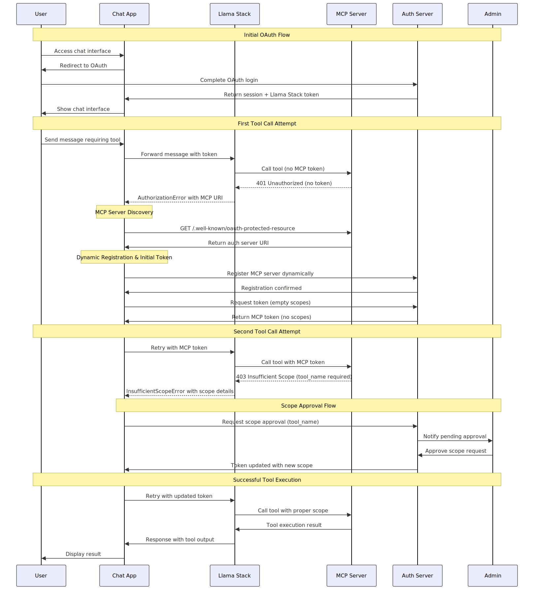

# 🔐 Authentication & Authorization System for AI Agents

A comprehensive authentication and authorization system for AI agents with **Google OAuth**, **JWT tokens**, **scope-based permissions**, and **real-time approval workflows**. Built for secure MCP (Model Context Protocol) tool access with automatic permission escalation.

## 🎯 **What This System Does**

This system provides **secure, granular access control** for AI agents interacting with system resources. Users authenticate once via Google OAuth, then the system automatically manages permissions as AI agents request access to different tools and resources.

### **Key Capabilities**
- 🔐 **Google OAuth Authentication** - Secure login with Google accounts
- 🎫 **JWT Token Management** - Automatic token generation and refresh
- 🔧 **MCP Tool Integration** - Secure access to file system, commands, and APIs
- 📋 **Dynamic Approval Workflows** - Auto-approve safe operations, require admin approval for risky ones
- 🤖 **AI Agent Integration** - Llama Stack agents with secure tool access
- 👑 **Admin Dashboard** - Real-time approval management and user oversight
- 🔄 **Auto-Retry Logic** - Seamless user experience when permissions are granted

## 🏗️ **System Architecture**

```
┌─────────────────┐    ┌─────────────────┐    ┌─────────────────┐
│   Chat UI       │    │   Auth Server   │    │   MCP Server    │
│   (Flask)       │◄──►│   (FastAPI)     │    │   (FastMCP)     │
│   Port 5001     │    │   Port 8002     │    │   Port 8001     │
└─────────────────┘    └─────────────────┘    └─────────────────┘
         │                       │                       │
         └───────────────────────┼───────────────────────┘
                                 ▼
                    ┌─────────────────┐    ┌─────────────────┐
                    │  Llama Stack    │    │ Admin Dashboard │
                    │  (AI Agents)    │    │   (Flask)       │
                    │  Port 8321      │    │   Port 8003     │
                    └─────────────────┘    └─────────────────┘
```

## 🚀 **Quick Start**

### **Prerequisites**
```bash
# Python 3.11+ required
python --version

# Install dependencies
pip install -r requirements.txt
```

### **Browser Recommendation**
🌐 **Recommended Browser: Google Chrome**
- OAuth flows are optimized for Chrome
- Token debugging features work best in Chrome
- Cookie management is most reliable in Chrome

### **Environment Setup**
```bash
# Copy environment template
cp env.example .env

# Edit .env file with your settings:
# - ADMIN_EMAIL (required)
# - OPENAI_API_KEY (required for AI agents)
# - GOOGLE_CLIENT_ID/SECRET (optional - demo login available)
```

### **Start the System**
```bash
# One command to start everything
./start_demo.sh

# Access the applications:
# - Chat UI: http://localhost:5001
# - Admin Dashboard: http://localhost:8003/dashboard
# - Auth Server: http://localhost:8002
```

### **Stop the System**
```bash
# Stop all services (preserves data)
./stop_demo.sh

# Complete cleanup (removes all data)
./cleanup_demo.sh
```

⚠️ **Important**: `stop_demo.sh` will **force close Chrome** to clear authentication cookies. Save any important Chrome work before running this command.

## 🔄 **System Overview & Authentication Flow**

### **System Components Overview**


### **OAuth and MCP Token Discovery Flow**
The following diagram shows the streamlined OAuth authentication and MCP token discovery process:



### **How It Works**

1. **🔐 Initial Authentication**
   - User accesses Chat UI → redirected to Google OAuth
   - After OAuth success → user gets Llama Stack session token
   - Session token enables basic chat functionality

2. **🔧 Tool Discovery & Authorization**
   - AI agent attempts to use MCP tool → gets 403 (insufficient scope)
   - System automatically requests required scope from auth server
   - Auth server evaluates policy: auto-approve safe tools, require admin approval for risky ones

3. **🎫 Token Exchange & Upgrade**
   - For auto-approved scopes: immediate token upgrade
   - For admin-required scopes: approval workflow with admin dashboard
   - User gets both Llama Stack and MCP tokens with appropriate scopes

4. **✅ Seamless Execution**
   - User retries request with new permissions
   - AI agent successfully executes tool with valid scope
   - Future requests use cached tokens until expiration

## 📋 **Demo Walkthrough**

### **1. First-Time User Experience**
1. **Access** http://localhost:5001
2. **Login** with Google OAuth (or demo login)
3. **Start with no permissions** - secure by default
4. **Try a command**: "List files in /tmp"
5. **See auto-approval** for safe operations
6. **View updated permissions** in token dashboard

### **2. Admin Approval Workflow**
1. **Try risky command**: "Execute command: ls -la"
2. **See approval request** created automatically
3. **Admin reviews** in dashboard at http://localhost:8003/dashboard
4. **Approve/deny** with justification
5. **User gets notification** and can retry

### **3. Token Management**
1. **View token dashboard** in chat UI
2. **See current scopes** and permissions
3. **Debug tokens** with JWT.io integration
4. **Monitor real-time updates** every 5 seconds

## 🔧 **Configuration**

### **Environment Variables**
```bash
# Required
ADMIN_EMAIL="your-admin@example.com"
OPENAI_API_KEY="your-openai-api-key"

# Optional (demo login available)
GOOGLE_CLIENT_ID="your-google-client-id"
GOOGLE_CLIENT_SECRET="your-google-client-secret"

# Advanced
JWT_MODE="asymmetric"  # or "symmetric"
AUTH_SERVER_URL="http://localhost:8002"
```

### **Permission Policies**
The system uses database-driven policies for different scopes:

| Scope | Description | Policy | Risk Level |
|-------|-------------|--------|------------|
| `list_files` | List directory contents | Auto-approve | Low |
| `read_file` | Read file contents | Auto-approve | Low |
| `health_check` | System health check | Auto-approve | Low |
| `execute_command` | Run system commands | Admin approval | Critical |
| `write_file` | Write to files | Admin approval | High |
| `delete_file` | Delete files | Admin approval | High |

## 🛡️ **Security Features**

### **Zero-Trust Architecture**
- **Users start with no permissions** - even returning users
- **Dynamic permission escalation** via token exchange
- **Every tool request is validated** against current token scopes
- **Admin oversight** for high-risk operations

### **JWT Token Security**
- **Asymmetric RS256 signing** with auto-generated keys
- **JWKS endpoint** for public key distribution
- **Token expiration** and refresh mechanisms
- **Secure cookie handling** across all services

### **Audit & Monitoring**
- **Complete audit trail** of all permission requests
- **Real-time approval workflows** with admin notifications
- **Comprehensive logging** across all services
- **JWT.io integration** for token debugging

## 📁 **Project Structure**

```
Authentication/
├── auth-server/                    # Authentication server
│   ├── main.py                    # FastAPI application
│   ├── database.py                # SQLite database operations
│   ├── api/                       # API routes
│   ├── auth/                      # Authentication logic
│   ├── utils/                     # Utilities (JWT, MCP, etc.)
│   └── config/                    # Configuration
├── frontends/
│   ├── chat-ui/                   # Chat interface
│   │   ├── app.py                 # Flask application
│   │   ├── api/                   # API blueprints
│   │   ├── templates/             # HTML templates
│   │   └── utils/                 # Utility functions
│   └── admin-dashboard/           # Admin interface
│       ├── app.py                 # Flask application
│       └── templates/             # HTML templates
├── mcp/                           # MCP server
│   ├── mcp_server.py              # FastMCP server
│   └── README.md                  # MCP documentation
├── services/                      # Llama Stack configuration
│   ├── stack/run.yml              # Llama Stack config
│   └── auth-agent/                # Custom auth agent
├── diagrams/                      # Architecture diagrams
│   ├── oauth-mcp-discovery-flow.mmd  # OAuth & MCP token flow
│   ├── system-overview.mmd        # System components overview
│   └── *.svg                      # Rendered diagrams
├── start_demo.sh                  # One-command startup
├── stop_demo.sh                   # Stop all services
└── cleanup_demo.sh                # Complete cleanup
```

## 🔍 **API Endpoints**

### **Chat UI (Port 5001)**
```
GET  /                             # Chat interface
GET  /callback                     # OAuth callback
POST /api/chat                     # Send message
GET  /api/chat-history             # Get chat history
GET  /api/token-info               # Token dashboard data
```

### **Auth Server (Port 8002)**
```
GET  /auth/authorize               # OAuth authorization
POST /auth/token                   # Token exchange
GET  /api/user-status              # Check authentication
POST /api/upgrade-scope            # Request scope upgrade
GET  /.well-known/jwks.json        # Public keys
```

### **Admin Dashboard (Port 8003)**
```
GET  /dashboard                    # Admin interface
GET  /api/pending-approvals        # Pending requests
POST /api/approve/{id}             # Approve request
POST /api/deny/{id}                # Deny request
```

## 🛠️ **Development**

### **Running Individual Services**
```bash
# Auth Server
cd auth-server
python main.py

# Chat UI
cd frontends/chat-ui
python app.py

# Admin Dashboard
cd frontends/admin-dashboard
python app.py

# MCP Server
cd mcp
python mcp_server.py
```

### **Database Management**
```bash
# View database contents
sqlite3 auth-server/auth.db

# Check users and roles
SELECT * FROM users;
SELECT * FROM user_roles;

# View approval policies
SELECT * FROM scope_policies;
```

## 🚨 **Troubleshooting**

### **Common Issues**

**Services won't start:**
```bash
# Check for port conflicts
lsof -i :5001 -i :5002 -i :8001 -i :8002 -i :8321

# Kill existing processes
./stop_demo.sh
```

**Authorization not working:**
```bash
# Check auth server logs
tail -f logs/auth-server.log

# Verify token in JWT.io
# (Use links in chat UI token dashboard)
```

**Google OAuth issues:**
```bash
# Use demo login instead
open http://localhost:8002/auth/demo-login
```

## 🤝 **Contributing**

1. **Fork** the repository
2. **Create** feature branch: `git checkout -b feature/amazing-feature`
3. **Test** with demo: `./start_demo.sh`
4. **Commit** changes: `git commit -m 'Add amazing feature'`
5. **Push** to branch: `git push origin feature/amazing-feature`
6. **Open** Pull Request

## 📜 **License**

This project is licensed under the MIT License - see the [LICENSE](LICENSE) file for details.

## 🙏 **Acknowledgments**

- **RFC 8693** Token Exchange specification
- **FastAPI** and **Flask** web frameworks
- **FastMCP** for Model Context Protocol
- **Llama Stack** for AI agent integration
- **JWT.io** for token debugging tools

---

**🌟 This system provides enterprise-grade authentication with zero-trust security, automatic user onboarding, and real-time permission management for AI agent interactions.** 