# Approval Workflows & Scope Upgrade Guide

This document describes the comprehensive approval workflows and dynamic scope escalation patterns for the unified authentication system.

## 🎯 **Overview**

The unified authentication system supports **dynamic scope escalation** with multiple approval workflows based on user roles, scope risk levels, and organizational policies. Users start with minimal permissions and can request additional scopes on-demand through an intuitive interface.

## 🏗️ **System Architecture**

The unified system consists of:
- **🔐 Unified Auth Server** (Port 8002) - Handles OAuth, JWT, scopes, approvals, and admin dashboard
- **📡 MCP Server** (Port 8001) - Executes tools with scope-based authorization
- **🦙 Llama Stack** (Port 8321) - AI agent runtime with auth-agent integration
- **🌐 Chat App** (Port 5001) - Web interface with streaming responses and approval UI

## 🔄 **Flow Decision Matrix**

| User Role | Scope Risk | Flow | Approval Time |
|-----------|------------|------|---------------|
| `admin` | Any | **Auto-Approve** | Immediate |
| `developer` | `read:files` | **Auto-Approve** | Immediate |
| `developer` | `execute:commands` | **Admin Approval** | 5-15 minutes |
| `user` | `read:files` | **Auto-Approve** | Immediate |
| `user` | `execute:commands` | **Admin Approval** | 5-15 minutes |
| Any | `admin:users` | **Admin Approval** | Always required |

## 🚀 **Flow 1: Auto-Approval**

**When:** User role allows automatic access to the requested scope

```mermaid
sequenceDiagram
    participant Client as Chat App
    participant Agent as Auth Agent
    participant Auth as Unified Auth Server
    participant MCP as MCP Server
    
    Client->>Agent: User requests tool execution
    Agent->>MCP: Call tool requiring scope
    MCP->>Agent: insufficient_scope error
    Agent->>Auth: POST /api/upgrade-scope
    Auth->>Auth: Check user role & scope policy
    Auth->>Auth: Auto-approve based on role
    Auth->>Agent: {"status": "approved", "auto_approved": true, "new_token": "..."}
    Agent->>Client: ✅ Auto-approved! Retry your request.
    Note over Client,Auth: ✅ Immediate access granted
```



**Example:** Admin user requesting any scope, or user requesting `read:files`

### **Implementation**
```python
def evaluate_approval_policy(user_email: str, requested_scopes: List[str]):
    user_roles = get_user_roles(user_email)
    auto_approved_scopes = []
    admin_scopes = []
    
    for scope in requested_scopes:
        scope_config = SCOPES.get(scope, {})
        auto_approve_roles = scope_config.get("auto_approve_roles", [])
        
        # Check if user has auto-approval role for this scope
        if any(role in auto_approve_roles for role in user_roles):
            auto_approved_scopes.append(scope)
        elif scope_config.get("requires_admin", False):
            admin_scopes.append(scope)
    
    return {
        "auto_approved": auto_approved_scopes,
        "requires_admin_approval": admin_scopes
    }
```

## 🛡️ **Flow 2: Admin Approval Required**

**When:** High-risk scopes requiring administrator oversight

```mermaid
sequenceDiagram
    participant Client as Chat App
    participant Agent as Auth Agent
    participant Auth as Unified Auth Server
    participant Admin as Admin Dashboard
    participant MCP as MCP Server
    
    Client->>Agent: User requests tool execution
    Agent->>MCP: Call tool requiring scope
    MCP->>Agent: insufficient_scope error
    Agent->>Auth: POST /api/upgrade-scope
    Auth->>Auth: Evaluate policy: admin_approval required
    Auth->>Auth: Create approval request
    Auth->>Agent: {"status": "pending_admin_approval", "approval_request_id": "..."}
    Agent->>Client: 🔐 Authorization required - show approval UI
    
    Admin->>Auth: GET /dashboard (check pending requests)
    Auth->>Admin: Show approval queue with pending request
    Admin->>Auth: POST /api/approve/{request_id}
    Auth->>Auth: Generate new token with approved scope
    Auth->>Client: Token updated (via session)
    Client->>Agent: User clicks "Retry Message"
    Agent->>MCP: Retry with upgraded token
    MCP->>Agent: ✅ Success
    Note over Client,Auth: ✅ Admin oversight for sensitive operations
```



**Example:** Any user requesting `execute:commands` or `admin:users`

### **Implementation**
```python
@app.post("/api/approve/{request_id}")
async def approve_request(request_id: str, admin_email: str = Form(...)):
    # Update approval request
    approval_request.status = ApprovalStatus.APPROVED
    approval_request.approved_by = admin_email
    approval_request.approved_at = datetime.utcnow()
    
    # Generate new token with approved scope for the user
    # Find user's current session and update with new scopes
    # Return success response
```

## 🎯 **Complete Scope Escalation Flow**

### **1. Initial Authentication (Minimal Scopes)**
- User visits chat app at `http://localhost:5001`
- Logs in with demo credentials or Google OAuth
- Receives JWT token with role-based auto-approved scopes
- Can access tools that don't require additional scopes

**Example Initial Scopes:**
- **Admin users:** All scopes auto-approved
- **Developer users:** `read:files` auto-approved
- **Regular users:** `read:files` auto-approved

### **2. Scope Detection & Authorization Error**
- When user attempts to use a tool requiring additional scopes (e.g., `execute_command`)
- Auth agent detects insufficient scopes in MCP server response
- Returns structured authorization error with upgrade information

**Authorization Error Response:**
```json
{
  "error_type": "authorization_error",
  "tool_name": "execute_command",
  "required_scope": "execute:commands",
  "current_scopes": ["read:files"],
  "approval_type": "admin_required",
  "user_email": "user@example.com"
}
```

### **3. Chat App Authorization UI**
- Chat app detects authorization error during streaming response
- Switches from streaming content to approval UI:
  - **🔓 Request Approval** button
  - **📋 Check Status** button
  - **🔄 Retry Message** button (initially disabled)
- Authorization error persists in chat history for transparency

### **4. Scope Upgrade Request**
- User clicks "🔓 Request Approval"
- Chat app makes POST request to `/api/upgrade-scope`
- Unified auth server evaluates approval policy:
  - **Auto-approve:** If user role allows (immediate token update)
  - **Admin approval:** Create approval request for admin review

### **5. Token Exchange & Retry**
- Upon approval (auto or admin), unified auth server generates new JWT with upgraded scopes
- User session automatically updated with new token
- "🔄 Retry Message" button becomes enabled
- User clicks retry → original command executes successfully with upgraded permissions

## 🎯 **Scope Configuration**

Each scope has a configuration that determines the approval flow:

```python
SCOPES = {
    "read:files": {
        "description": "Read file system information",
        "risk_level": "low",
        "requires_admin": False,           # Can be auto-approved
        "auto_approve_roles": ["user", "developer", "admin"]  # These roles get instant access
    },
    "execute:commands": {
        "description": "Execute system commands",
        "risk_level": "critical", 
        "requires_admin": True,            # Always requires admin approval
        "auto_approve_roles": ["admin"]    # Only admins get instant access
    },
    "admin:users": {
        "description": "Manage user accounts and permissions",
        "risk_level": "critical",
        "requires_admin": True,            # Always requires admin approval
        "auto_approve_roles": []           # No auto-approval, even for admins
    }
}
```

## 👥 **User Roles**

Users are automatically created with roles when they first log in via Google OAuth:

```python
# Default role assignment (can be customized)
def determine_user_role(email: str) -> List[str]:
    # Admin user (pre-configured)
    if email == os.getenv("ADMIN_EMAIL", "gallettilance@gmail.com"):
        return ["admin", "developer"]
    
    # Example: Role assignment based on email domain
    if email.endswith("@company.com"):
        return ["developer"]
    elif email.endswith("@manager.company.com"):
        return ["manager", "user"]
    else:
        return ["user"]  # Default role for all other users
```

**Current Configuration:**
- **Admin:** `gallettilance@gmail.com` (pre-configured)
- **All other users:** Automatically assigned `user` role on first login

## 🛠️ **Unified Admin Dashboard Features**

Visit `http://localhost:8002/dashboard` (admin role required):

- **📊 Dashboard Statistics** - Pending, approved, denied counts
- **📋 Approval Queue** - All pending high-risk scope requests
- **👤 User Context** - Who's requesting what and when
- **📝 Justification** - Why the scope is being requested
- **⚡ One-click Actions** - Approve or deny with audit trail
- **🔧 Tool Visualization** - See all available MCP tools and user access
- **🎯 Real-time Updates** - Live approval status changes

### **Dashboard API Endpoints**
- `GET /dashboard` - Admin dashboard interface
- `POST /api/approve/{request_id}` - Approve scope request
- `POST /api/deny/{request_id}` - Deny scope request
- `GET /api/status/{request_id}` - Check approval status

## 🎨 **Chat App Integration**

### **Authorization Error Handling**
```python
def stream_agent_response(response):
    for log in EventLogger().log(response):
        # Detect authorization errors mid-stream
        if "__AUTH_ERROR_START__" in log.content:
            # Switch to approval UI instead of continuing stream
            yield authorization_error_ui(error_details)
        else:
            yield log.content
```

### **Approval UI Components**
- **🔓 Request Approval** - Submits approval request to unified auth server
- **📋 Check Status** - Polls approval status with visual indicators
- **🔄 Retry Message** - Re-executes original command with upgraded token

## 🔐 **Security Benefits**

### **Auto-Approval**
- ✅ **Efficiency** - No friction for trusted users
- ✅ **Role-based** - Leverages existing identity systems
- ✅ **Auditable** - All auto-approvals are logged

### **Admin Approval**
- ✅ **Oversight** - Human review for sensitive operations
- ✅ **Policy enforcement** - Organizational security controls
- ✅ **Real-time processing** - Integrated dashboard for immediate action
- ✅ **Session integration** - Seamless token updates

### **Dynamic Permission Escalation**
- ✅ **Users only get permissions when needed**
- ✅ **Scopes accumulate over time** (no re-approval needed)
- ✅ **Time-limited approval requests** (10-minute expiry)

## 🎯 **Available Scopes & Tools**

| Scope | Risk Level | Tools | Auto-Approve Roles |
|-------|------------|-------|-------------------|
| `none` | None | `get_server_info`, `health_check` | All users |
| `read:files` | Low | `list_files` | `user`, `developer`, `admin` |
| `execute:commands` | Critical | `execute_command` | `admin` only |
| `admin:users` | Critical | User management tools | None (always requires approval) |

## 🛠️ **Testing the Complete Flow**

### **1. Start the Demo Environment**
```bash
./start_demo.sh
```

### **2. Test Auto-Approval (Regular User → read:files)**
1. Login with any Google account (will be auto-created as `user` role)
2. Try: "List files in the current directory"
3. Should auto-approve and execute immediately

### **3. Test Admin Approval (Regular User → execute:commands)**
1. Try: "Execute the command 'ps aux | head -5'"
2. Should show approval UI
3. Click "Request Approval" 
4. Open admin dashboard in new tab
5. Login as `gallettilance@gmail.com` (pre-configured admin)
6. Approve the request
7. Return to chat and click "Retry Message"

## 📊 **API Endpoints**

### **Scope Upgrade**
- `POST /api/upgrade-scope` - Request scope upgrade (legacy)
- `POST /oauth/token` - RFC 8693 Token Exchange (recommended)
- `POST /api/request-approval` - Submit approval request
- `GET /api/status/{request_id}` - Check approval status

### **Admin Functions**
- `GET /dashboard` - Admin dashboard with approval queue
- `POST /api/approve/{request_id}` - Admin approval action
- `POST /api/deny/{request_id}` - Admin denial action

### **Chat App**
- `POST /request-approval` - Submit approval request
- `GET /check-approval/{request_id}` - Poll approval status
- `POST /retry-message` - Retry with upgraded token

## 🔄 **Policy Customization**

You can customize the approval flows by modifying:

1. **Scope Risk Levels** - Add `medium`, adjust thresholds
2. **Role Permissions** - Define which roles can auto-approve what
3. **Approval Timeouts** - Configure request expiration times
4. **Admin Notifications** - Set up real-time approval alerts

### **Example Custom Scope**
```python
SCOPES["write:files"] = {
    "description": "Write to file system",
    "risk_level": "medium",
    "requires_admin": False,
    "auto_approve_roles": ["developer", "admin"]
}
```

## 🔗 **Related Documentation**

- **[README.md](README.md)** - Main auth server documentation
- **[TOKEN_EXCHANGE.md](TOKEN_EXCHANGE.md)** - RFC 8693 token exchange implementation

## 🎉 **Conclusion**

The approval workflows provide a flexible, secure, and user-friendly system for dynamic permission escalation. The system balances security with usability by automatically approving trusted operations while requiring admin oversight for high-risk activities. The integrated dashboard and real-time approval system ensure that users can get the permissions they need quickly while maintaining organizational security controls. 