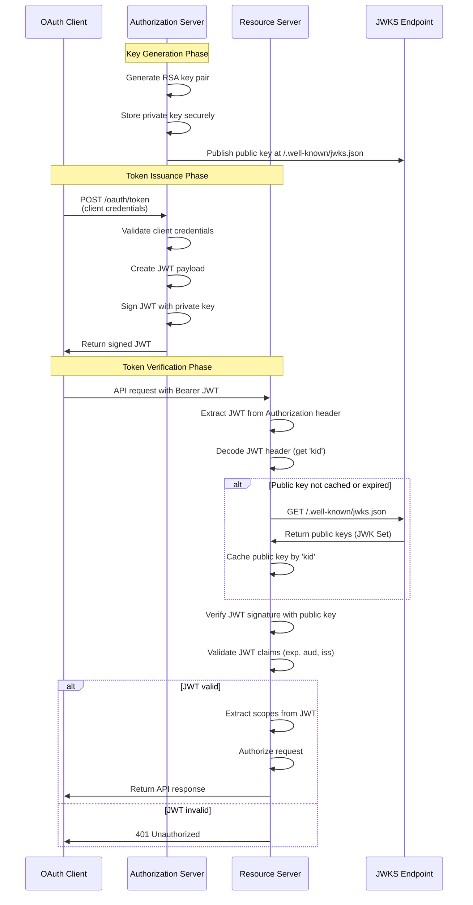
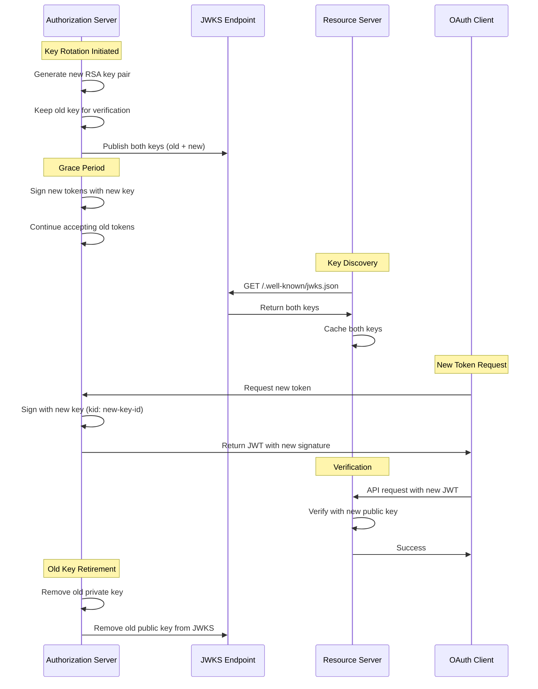

# Asymmetric JWT Verification

## Why JWT Signatures Matter

Before diving into asymmetric verification, it's crucial to understand what problem JWT signatures solve. **Without any signature verification, JWT tokens are completely worthless from a security perspective.**

### The Catastrophic Risk of Unsigned Tokens

Without signatures, anyone could create or modify tokens:

```json
// Any attacker could craft this token:
{
  "iss": "https://your-auth-server.com",
  "sub": "admin@company.com", 
  "scope": "admin:everything delete:all-data",
  "exp": 9999999999
}
```

**Result**: Complete system compromise - unauthorized access, privilege escalation, data breaches, and service disruption.

### The Security Hierarchy

```
🔴 No Signatures: Complete vulnerability (anyone can forge tokens)
🟡 Symmetric Signatures: Good protection, poor scalability
🟢 Asymmetric Signatures: Best security and scalability
```

## Symmetric vs Asymmetric JWT Verification

### Symmetric Verification (HMAC) - The Scaling Problem

Most systems start with symmetric verification using shared secrets:

```javascript
// All services share the same secret
const secret = "shared-secret-key-123";
const token = jwt.sign(payload, secret, { algorithm: 'HS256' });
const verified = jwt.verify(token, secret); // Same secret everywhere
```

**Problems with Symmetric Verification:**

1. **Secret Distribution Challenge**
   - Every resource server needs the same secret
   - Secure distribution becomes complex with many services
   - Configuration management nightmare

2. **Security Risk Amplification**
   - If ANY service is compromised, ALL tokens are compromised
   - Single point of failure across entire system
   - Breach in one service affects all services

3. **Operational Complexity**
   - Key rotation requires coordinated updates across all services
   - Downtime during key rotation
   - Difficult to audit which services have current keys

4. **Trust Boundary Issues**
   - Every service that verifies tokens can also create them
   - No distinction between token issuers and token consumers
   - Insider threats have broader impact

### Asymmetric Verification (RSA/ECDSA) - The Scalable Solution

Asymmetric verification solves these problems using public-key cryptography:

```javascript
// Authorization server signs with private key
const privateKey = loadPrivateKey();
const token = jwt.sign(payload, privateKey, { algorithm: 'RS256' });

// Resource servers verify with public key (different key!)
const publicKey = fetchPublicKey();
const verified = jwt.verify(token, publicKey);
```

**Advantages of Asymmetric Verification:**

1. **No Shared Secrets**
   - Resource servers only need public keys
   - Public keys can be distributed openly
   - No secret distribution complexity

2. **Isolated Security**
   - Compromised resource server cannot forge tokens
   - Only authorization server can create valid tokens
   - Clear separation of concerns

3. **Effortless Scaling**
   - New resource servers can verify tokens immediately
   - No coordination required with authorization server
   - Self-service token verification

4. **Simplified Key Rotation**
   - Only authorization server manages private keys
   - Public key rotation via JWKS endpoint
   - Zero-downtime key rotation possible

## Real-World Impact

Consider a system with 10 MCP servers:

**Symmetric Approach:**
- 10 services × 1 shared secret = 10 copies of the same secret
- 1 compromised service = entire system compromised
- Key rotation = coordinate updates across 10 services

**Asymmetric Approach:**
- 1 private key (auth server) + 10 public keys (cached from JWKS)
- 1 compromised service = only that service affected
- Key rotation = update JWKS endpoint, services auto-refresh

## Overview

Asymmetric JWT verification uses public-key cryptography where the **Authorization Server** signs tokens with a **private key** and **Resource Servers** verify tokens using the corresponding **public key**. This eliminates the need for shared secrets between the authorization server and multiple resource servers, providing superior security and scalability.

## Key Concepts

### 1. Key Pair Generation
- **Private Key**: Used by Authorization Server to sign JWTs
- **Public Key**: Used by Resource Servers to verify JWT signatures
- **Algorithm**: Typically RS256 (RSA with SHA-256) or ES256 (ECDSA with SHA-256)

### 2. JWT Structure
```
Header.Payload.Signature
```

**Header:**
```json
{
  "alg": "RS256",
  "typ": "JWT",
  "kid": "key-id-123"
}
```

**Payload:**
```json
{
  "iss": "https://auth.example.com",
  "aud": "https://api.example.com",
  "sub": "user123",
  "exp": 1640995200,
  "iat": 1640991600,
  "scope": "read write"
}
```

**Signature:**
```
RSASHA256(
  base64UrlEncode(header) + "." + base64UrlEncode(payload),
  private_key
)
```

## Asymmetric JWT Verification Flow



## JWKS (JSON Web Key Set) Endpoint

The Authorization Server publishes its public keys at a well-known endpoint:

**Endpoint:** `/.well-known/jwks.json`

**Response Format:**
```json
{
  "keys": [
    {
      "kty": "RSA",
      "use": "sig",
      "kid": "key-id-123",
      "alg": "RS256",
      "n": "0vx7agoebGcQSuuPiLJXZptN9nndrQmbXEps2aiAFbWhM78LhWx4cbbfAAtVT86zwu1RK7aPFFxuhDR1L6tSoc_BJECPebWKRXjBZCiFV4n3oknjhMstn64tZ_2W-5JsGY4Hc5n9yBXArwl93lqt7_RN5w6Cf0h4QyQ5v-65YGjQR0_FDW2QvzqY368QQMicAtaSqzs8KJZgnYb9c7d0zgdAZHzu6qMQvRL5hajrn1n91CbOpbIS",
      "e": "AQAB"
    }
  ]
}
```

## Verification Steps Detail

### 1. JWT Extraction
```javascript
const authHeader = request.headers.authorization;
const token = authHeader && authHeader.split(' ')[1]; // Remove 'Bearer '
```

### 2. JWT Decoding
```javascript
const decoded = jwt.decode(token, { complete: true });
const { header, payload } = decoded;
const keyId = header.kid;
```

### 3. Public Key Retrieval
```javascript
// Check cache first
let publicKey = keyCache.get(keyId);

if (!publicKey) {
  // Fetch from JWKS endpoint
  const jwks = await fetch('https://auth.example.com/.well-known/jwks.json');
  const keys = await jwks.json();
  
  // Find key by kid
  const key = keys.keys.find(k => k.kid === keyId);
  publicKey = jwkToPem(key);
  
  // Cache the key
  keyCache.set(keyId, publicKey, { ttl: 3600 }); // 1 hour
}
```

### 4. Signature Verification
```javascript
try {
  const verified = jwt.verify(token, publicKey, {
    algorithms: ['RS256'],
    issuer: 'https://auth.example.com',
    audience: 'https://api.example.com'
  });
  
  // Token is valid, extract claims
  const { sub, scope, exp } = verified;
  
} catch (error) {
  // Token is invalid
  return res.status(401).json({ error: 'Invalid token' });
}
```

## Advantages of Asymmetric Verification

### 1. **No Shared Secrets**
- Resource servers don't need to share secrets with auth server
- Eliminates secret distribution and rotation challenges
- Reduces security risks from compromised secrets

### 2. **Scalability**
- New resource servers can verify tokens without auth server coordination
- Public keys can be cached and reused
- No need to register each resource server individually

### 3. **Security**
- Private key stays with authorization server only
- Public key exposure doesn't compromise security
- Key rotation is handled centrally

### 4. **Standard Compliance**
- Follows OAuth 2.0 and OpenID Connect standards
- Compatible with existing JWT libraries
- Supports standard key discovery mechanisms

## Key Rotation Process



## Security Considerations

### 1. **Key Management**
- Private keys must be stored securely (HSM, encrypted storage)
- Regular key rotation (recommended: every 6-12 months)
- Secure key generation with sufficient entropy

### 2. **JWKS Endpoint Security**
- Serve over HTTPS only
- Implement rate limiting
- Consider CDN for global distribution
- Monitor for unauthorized access

### 3. **Token Validation**
- Always verify signature before trusting claims
- Validate all standard claims (exp, aud, iss)
- Implement proper error handling
- Use secure JWT libraries

### 4. **Caching Strategy**
- Cache public keys with appropriate TTL
- Implement cache invalidation on key rotation
- Handle cache misses gracefully
- Monitor cache hit rates

## Implementation Example

### Authorization Server (Token Signing)
```python
import jwt
from cryptography.hazmat.primitives import serialization

# Load private key
with open('private_key.pem', 'rb') as f:
    private_key = serialization.load_pem_private_key(
        f.read(),
        password=None
    )

# Create JWT
payload = {
    'iss': 'https://auth.example.com',
    'aud': 'https://api.example.com',
    'sub': 'user123',
    'exp': int(time.time()) + 3600,  # 1 hour
    'scope': 'read write'
}

token = jwt.encode(
    payload,
    private_key,
    algorithm='RS256',
    headers={'kid': 'key-id-123'}
)
```

### Resource Server (Token Verification)
```python
import jwt
import requests
from cryptography.hazmat.primitives import serialization

# Fetch public key from JWKS
def get_public_key(kid):
    jwks_url = 'https://auth.example.com/.well-known/jwks.json'
    jwks = requests.get(jwks_url).json()
    
    for key in jwks['keys']:
        if key['kid'] == kid:
            return jwt.algorithms.RSAAlgorithm.from_jwk(key)
    
    raise ValueError(f"Key {kid} not found")

# Verify JWT
def verify_token(token):
    try:
        # Decode header to get kid
        header = jwt.get_unverified_header(token)
        kid = header['kid']
        
        # Get public key
        public_key = get_public_key(kid)
        
        # Verify token
        payload = jwt.decode(
            token,
            public_key,
            algorithms=['RS256'],
            audience='https://api.example.com',
            issuer='https://auth.example.com'
        )
        
        return payload
        
    except jwt.InvalidTokenError as e:
        raise ValueError(f"Invalid token: {e}")
```

## Migration from Symmetric to Asymmetric

### Phase 1: Dual Mode Support
1. Generate RSA key pair
2. Support both HMAC and RSA signature verification
3. Publish JWKS endpoint
4. Update resource servers to fetch public keys

### Phase 2: Transition Period
1. Start signing new tokens with RSA
2. Continue verifying HMAC tokens for existing ones
3. Monitor token verification metrics
4. Gradually phase out HMAC support

### Phase 3: Full Asymmetric
1. Stop issuing HMAC tokens
2. Remove HMAC verification code
3. Remove shared secrets from configuration
4. Full asymmetric verification only

This approach ensures zero-downtime migration while maintaining security throughout the transition.