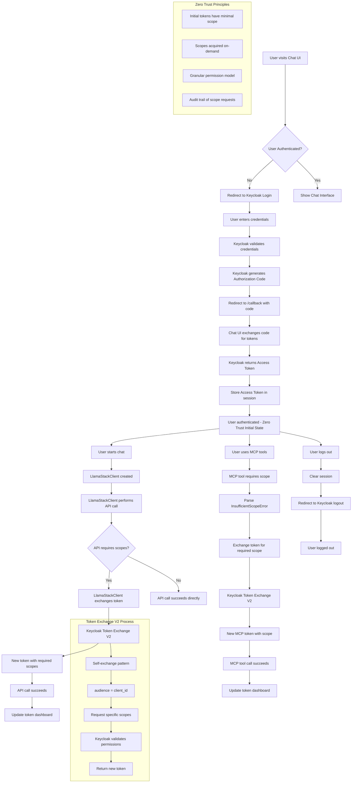

# Authentication and Authorization Flow Chart

## Overview
This document describes the complete authentication and authorization flow in the Authentication Demo repository, from initial login through token exchange and service access.

## Flow Chart

## Key Components

### 1. Initial Authentication (OIDC/OAuth2)
- **Entry Point**: User visits Chat UI at `http://localhost:5001`
- **Authentication Server**: Keycloak at `http://localhost:8002`
- **Client**: `authentication-demo` (confidential client)
- **Flow**: Authorization Code Flow with PKCE
- **Initial Scopes**: Basic OIDC scopes only (`openid`, `profile`, `email`)

### 2. Token Exchange V2 (RFC 8693)
- **Pattern**: Self-exchange (audience = client_id)
- **Trigger**: Service requires additional scopes
- **Process**: Exchange current token for new token with specific scopes
- **Security**: Validates user has permission for requested scopes

### 3. Service-Specific Token Management

#### Llama Stack
- **Client**: `LlamaStackClient` with OAuth2Config
- **Token Source**: Automatic exchange via client
- **Scopes**: `llama:inference`, `llama:models:read`, etc.
- **Dashboard**: Queries client's current token

#### MCP (Model Context Protocol)
- **Token Source**: Manual exchange via API endpoints
- **Scopes**: `mcp:list_files`, `mcp:health_check`, etc.
- **Error Handling**: Parses `InsufficientScopeError` for required scopes

### 4. Zero Trust Architecture
- **Principle**: Start with minimal permissions
- **Implementation**: Initial tokens have no service-specific scopes
- **Escalation**: Acquire scopes only when services are used
- **Audit**: All scope requests are logged and tracked

## Token Lifecycle

### Phase 1: Initial Authentication
1. User logs in via Keycloak
2. Receive access token with basic OIDC scopes
3. Store token in Flask session
4. No service-specific tokens yet

### Phase 2: Service Access
1. User interacts with service (chat/MCP)
2. Service requires specific scopes
3. Token exchange triggered automatically
4. New token with required scopes
5. Service call proceeds
6. Token dashboard updated

### Phase 3: Continuous Operation
1. Services continue to work with current tokens
2. Additional scope requests trigger new exchanges
3. Token dashboard reflects current state
4. Logout clears all tokens

## Security Features

### Token Validation
- **JWT Verification**: All tokens verified by services
- **Key Rotation**: Handled via JWKS endpoints
- **Audience Validation**: Ensures tokens for correct services
- **Scope Validation**: Services check required permissions

### Authorization Policies
- **Role-Based**: Users have specific roles (user/admin)
- **Scope-Based**: Each scope has minimum role requirement
- **Resource-Based**: MCP tools have specific scope requirements
- **Policy-Based**: Keycloak policies enforce access rules

### Audit and Monitoring
- **Token Dashboard**: Real-time token status
- **Scope Tracking**: All scope requests logged
- **Error Handling**: Graceful handling of insufficient scopes
- **Session Management**: Secure session handling

## Error Handling

### Common Scenarios
1. **Insufficient Scopes**: Automatic token exchange
2. **Expired Tokens**: Automatic refresh via OAuth2
3. **Key Rotation**: JWKS cache refresh
4. **Network Issues**: Retry with exponential backoff
5. **Authorization Denied**: User-friendly error messages

### Recovery Mechanisms
1. **Token Refresh**: Automatic via OAuth2 flow
2. **Scope Escalation**: On-demand scope acquisition
3. **Session Recovery**: Maintain user state across errors
4. **Fallback Tokens**: Session tokens as backup

## Configuration

### Keycloak Setup
- **Realm**: `authentication-demo`
- **Client**: `authentication-demo` (confidential)
- **Scopes**: Comprehensive scope definitions
- **Roles**: User and admin roles with specific permissions
- **Policies**: Authorization policies for scope enforcement

### Service Configuration
- **Llama Stack**: OAuth2Config for automatic token exchange
- **MCP Server**: Token validation and scope checking
- **Chat UI**: Session management and token storage
- **Token Dashboard**: Real-time token status display

## Monitoring and Debugging

### Token Dashboard Features
- **Current Token Status**: Shows active tokens
- **Scope Information**: Displays current scopes
- **Token Source**: Indicates token origin (client/session)
- **Exchange History**: Tracks token exchange events
- **Error Information**: Shows recent errors and resolutions

### Debug Endpoints
- `/debug/token`: Current token information
- `/debug/session`: Session state
- `/api/tokens/token-info`: Detailed token analysis
- `/api/tokens/llama-stack-token-info`: Llama Stack specific info

## Best Practices

### Security
1. **Zero Trust**: Start with minimal permissions
2. **Scope Granularity**: Request only needed scopes
3. **Token Rotation**: Regular token refresh
4. **Audit Logging**: Track all authorization events

### Performance
1. **Token Caching**: Cache tokens appropriately
2. **Connection Pooling**: Reuse HTTP connections
3. **Error Handling**: Graceful degradation
4. **Monitoring**: Real-time status tracking

### User Experience
1. **Seamless Authentication**: Single sign-on
2. **Transparent Escalation**: Automatic scope acquisition
3. **Clear Feedback**: Token dashboard visibility
4. **Error Recovery**: Automatic retry mechanisms 