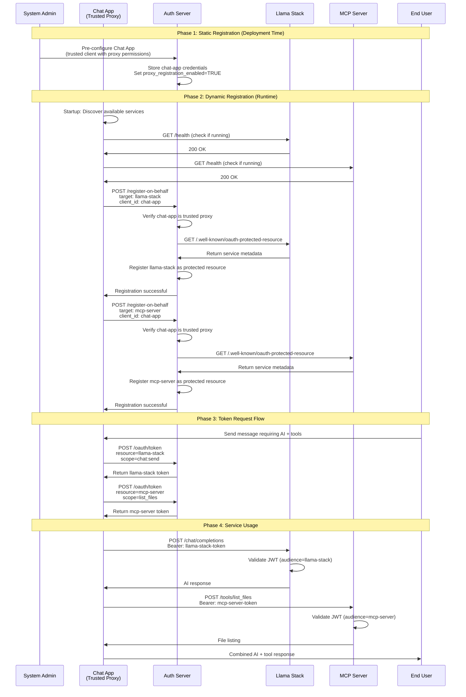

# Dynamic Registration Requirements

## Overview

This document outlines the requirements for implementing a **trusted proxy registration pattern** in our authentication system. Unlike traditional OAuth flows where each service registers itself, our system uses a unique pattern where the **Chat App acts as a trusted registration proxy** for Llama Stack and MCP Server resources.

## System Architecture

### Three Distinct Clients

1. **Chat App** (`chat-app`)
   - **Role**: Trusted OAuth client and registration proxy
   - **Registration**: Static (pre-configured, fully trusted)
   - **Capabilities**: Requests tokens for other services, registers resources on their behalf
   - **Token Usage**: Uses session tokens for its own authentication

2. **Llama Stack** (`llama-stack`)
   - **Role**: Protected resource (AI service)
   - **Registration**: Dynamic via Chat App proxy
   - **Capabilities**: Validates tokens, provides AI services
   - **Token Usage**: Receives tokens from Chat App for API calls

3. **MCP Server** (`mcp-server`)
   - **Role**: Protected resource (tool execution service)
   - **Registration**: Dynamic via Chat App proxy
   - **Capabilities**: Validates tokens, executes tools
   - **Token Usage**: Receives tokens from Chat App for tool execution

### Trust Relationships

```
Auth Server (fully trusts) → Chat App (trusted proxy)
Chat App (registers on behalf of) → Llama Stack + MCP Server
Auth Server (issues tokens for) → Llama Stack + MCP Server
```

## Registration Flow Patterns

### 1. Chat App Registration (Static)

**When**: System initialization / deployment
**Who**: System administrator or deployment script
**Method**: Pre-configured in auth server database

```sql
-- Chat App is statically registered as trusted client
INSERT INTO oauth_clients (
    client_id, client_secret_hash, client_name, client_type,
    proxy_registration_enabled, is_trusted_proxy
) VALUES (
    'chat-app', 
    'hashed_secret', 
    'Chat Application', 
    'confidential',
    TRUE,
    TRUE
);
```

### 2. Llama Stack Registration (Dynamic via Proxy)

**When**: Chat App startup / service discovery
**Who**: Chat App (on behalf of Llama Stack)
**Method**: Trusted proxy registration

```javascript
// Chat App discovers and registers Llama Stack
const llamaStackRegistration = {
  target_uri: 'http://localhost:8321',
  target_name: 'Llama Stack AI Service',
  supported_scopes: ['chat:send', 'model:access', 'inference:run'],
  service_type: 'ai-service'
};

await chatApp.registerServiceOnBehalf(llamaStackRegistration);
```

### 3. MCP Server Registration (Dynamic via Proxy)

**When**: Chat App startup / service discovery
**Who**: Chat App (on behalf of MCP Server)
**Method**: Trusted proxy registration

```javascript
// Chat App discovers and registers MCP Server
const mcpServerRegistration = {
  target_uri: 'http://localhost:9001',
  target_name: 'MCP Tool Execution Server',
  supported_scopes: ['list_files', 'execute_command', 'read_files'],
  service_type: 'mcp-server'
};

await chatApp.registerServiceOnBehalf(mcpServerRegistration);
```

## Complete Registration and Token Flow



## Implementation Requirements

### 1. Enhanced Database Schema

```sql
-- Enhanced OAuth clients table
CREATE TABLE oauth_clients (
    id INTEGER PRIMARY KEY AUTOINCREMENT,
    client_id TEXT UNIQUE NOT NULL,
    client_secret_hash TEXT NOT NULL,
    client_name TEXT,
    client_type TEXT DEFAULT 'confidential',
    description TEXT,
    -- Proxy registration capabilities
    proxy_registration_enabled BOOLEAN DEFAULT FALSE,
    is_trusted_proxy BOOLEAN DEFAULT FALSE,
    max_proxy_registrations INTEGER DEFAULT 10,
    allowed_proxy_patterns TEXT, -- JSON array of URI patterns
    -- Standard OAuth fields
    token_exchange_enabled BOOLEAN DEFAULT TRUE,
    allowed_audiences TEXT, -- JSON array
    is_active BOOLEAN DEFAULT TRUE,
    created_at TIMESTAMP DEFAULT CURRENT_TIMESTAMP,
    updated_at TIMESTAMP DEFAULT CURRENT_TIMESTAMP
);

-- Protected resources table (registered via proxy)
CREATE TABLE protected_resources (
    id INTEGER PRIMARY KEY AUTOINCREMENT,
    resource_id TEXT UNIQUE NOT NULL,
    resource_name TEXT NOT NULL,
    resource_uri TEXT UNIQUE NOT NULL,
    service_type TEXT, -- 'ai-service', 'mcp-server', etc.
    supported_scopes TEXT, -- JSON array
    token_validation_method TEXT DEFAULT 'jwt_asymmetric',
    -- Registration tracking
    registered_by TEXT NOT NULL, -- Which client registered this resource
    registration_method TEXT DEFAULT 'proxy', -- 'static', 'proxy', 'self'
    discovery_endpoint TEXT DEFAULT '/.well-known/oauth-protected-resource',
    health_check_endpoint TEXT DEFAULT '/health',
    -- Metadata
    software_id TEXT,
    software_version TEXT,
    is_active BOOLEAN DEFAULT TRUE,
    created_at TIMESTAMP DEFAULT CURRENT_TIMESTAMP,
    updated_at TIMESTAMP DEFAULT CURRENT_TIMESTAMP,
    last_health_check TIMESTAMP,
    FOREIGN KEY (registered_by) REFERENCES oauth_clients(client_id)
);

-- Track proxy registration permissions and limits
CREATE TABLE proxy_registration_permissions (
    client_id TEXT NOT NULL,
    resource_pattern TEXT NOT NULL, -- URI pattern like 'http://localhost:*'
    max_registrations INTEGER DEFAULT 10,
    allowed_service_types TEXT, -- JSON array: ['ai-service', 'mcp-server']
    created_at TIMESTAMP DEFAULT CURRENT_TIMESTAMP,
    FOREIGN KEY (client_id) REFERENCES oauth_clients(client_id)
);
```

### 2. API Endpoints

#### Trusted Proxy Registration
```python
@app.post("/register-on-behalf")
async def register_on_behalf(
    request: ProxyRegistrationRequest,
    client_credentials: ClientCredentials = Depends(verify_client_credentials)
):
    # Verify client is authorized for proxy registration
    if not await is_trusted_proxy_client(client_credentials.client_id):
        raise HTTPException(403, "Client not authorized for proxy registration")
    
    # Validate registration request
    await validate_proxy_registration_request(request, client_credentials.client_id)
    
    # Verify target service is reachable and supports OAuth
    service_metadata = await verify_service_oauth_support(request.target_uri)
    
    # Register the protected resource
    resource_registration = await register_protected_resource(
        resource_uri=request.target_uri,
        resource_name=request.target_name,
        service_type=request.service_type,
        supported_scopes=service_metadata.scopes_supported,
        registered_by=client_credentials.client_id
    )
    
    return resource_registration

class ProxyRegistrationRequest(BaseModel):
    target_uri: str
    target_name: str
    service_type: str  # 'ai-service', 'mcp-server'
    expected_scopes: Optional[List[str]] = None
```

#### Enhanced Token Endpoint
```python
@app.post("/oauth/token")
async def token_endpoint(
    grant_type: str = Form(...),
    client_id: str = Form(...),
    client_secret: str = Form(...),
    resource: Optional[str] = Form(default=None),  # Target resource URI
    scope: str = Form(default="")
):
    # Validate client credentials
    client = await validate_client_credentials(client_id, client_secret)
    
    if resource:
        # Verify resource exists and was registered by this client or its proxy
        resource_info = await get_protected_resource(resource)
        if not resource_info:
            raise HTTPException(400, "Unknown resource")
        
        # Generate resource-specific token
        token = await generate_resource_token(
            client_id=client_id,
            resource_uri=resource,
            audience=resource,
            scopes=scope.split(),
            resource_type=resource_info.service_type
        )
    else:
        # Generate general client token
        token = await generate_client_token(client_id, scope.split())
    
    return {"access_token": token, "token_type": "Bearer"}
```

### 3. Chat App Registration Logic

```javascript
class TrustedProxyRegistrationManager {
  constructor(authServerUrl, clientCredentials) {
    this.authServerUrl = authServerUrl;
    this.clientCredentials = clientCredentials;
    this.registeredServices = new Map();
  }
  
  async initializeServiceRegistrations() {
    console.log('Discovering and registering services...');
    
    // Discover and register Llama Stack
    if (await this.isServiceAvailable('http://localhost:8321')) {
      await this.registerLlamaStack();
    }
    
    // Discover and register MCP Server
    if (await this.isServiceAvailable('http://localhost:9001')) {
      await this.registerMCPServer();
    }
    
    // Start health monitoring
    this.startHealthMonitoring();
  }
  
  async registerLlamaStack() {
    const registration = {
      target_uri: 'http://localhost:8321',
      target_name: 'Llama Stack AI Service',
      service_type: 'ai-service',
      expected_scopes: ['chat:send', 'model:access', 'inference:run']
    };
    
    await this.registerServiceOnBehalf(registration);
  }
  
  async registerMCPServer() {
    // Fetch MCP server capabilities
    const mcpMetadata = await this.fetchMCPCapabilities('http://localhost:9001');
    
    const registration = {
      target_uri: 'http://localhost:9001',
      target_name: 'MCP Tool Execution Server',
      service_type: 'mcp-server',
      expected_scopes: mcpMetadata.scopes_supported || ['list_files', 'execute_command']
    };
    
    await this.registerServiceOnBehalf(registration);
  }
  
  async registerServiceOnBehalf(registration) {
    try {
      const response = await fetch(`${this.authServerUrl}/register-on-behalf`, {
        method: 'POST',
        headers: {
          'Content-Type': 'application/json',
          'Authorization': `Basic ${btoa(`${this.clientCredentials.client_id}:${this.clientCredentials.client_secret}`)}`
        },
        body: JSON.stringify(registration)
      });
      
      if (response.ok) {
        const result = await response.json();
        this.registeredServices.set(registration.target_uri, result);
        console.log(`✅ Successfully registered ${registration.target_name}`);
      } else {
        console.error(`❌ Failed to register ${registration.target_name}:`, await response.text());
      }
    } catch (error) {
      console.error(`❌ Registration error for ${registration.target_name}:`, error);
    }
  }
  
  async fetchMCPCapabilities(mcpUri) {
    try {
      const response = await fetch(`${mcpUri}/.well-known/oauth-protected-resource`);
      return await response.json();
    } catch (error) {
      console.warn(`Could not fetch MCP capabilities from ${mcpUri}, using defaults`);
      return { scopes_supported: ['list_files', 'execute_command', 'get_server_info'] };
    }
  }
  
  startHealthMonitoring() {
    setInterval(async () => {
      await this.checkServiceHealth();
    }, 60000); // Check every minute
  }
  
  async checkServiceHealth() {
    for (const [uri, registration] of this.registeredServices) {
      const isHealthy = await this.isServiceAvailable(uri);
      if (!isHealthy) {
        console.warn(`⚠️  Service ${uri} appears to be down`);
        // Could implement automatic re-registration or cleanup here
      }
    }
  }
  
  async isServiceAvailable(uri) {
    try {
      const response = await fetch(`${uri}/health`, { 
        method: 'GET',
        timeout: 5000 
      });
      return response.ok;
    } catch (error) {
      return false;
    }
  }
}
```

## Security Considerations

### 1. Trusted Proxy Validation
```python
async def is_trusted_proxy_client(client_id: str) -> bool:
    client = await get_client(client_id)
    return (
        client and 
        client.is_active and 
        client.proxy_registration_enabled and 
        client.is_trusted_proxy
    )
```

### 2. Registration Limits and Patterns
```python
PROXY_REGISTRATION_POLICIES = {
    "chat-app": {
        "max_registrations": 20,
        "allowed_patterns": [
            "http://localhost:*",
            "https://*.internal.company.com/*"
        ],
        "allowed_service_types": ["ai-service", "mcp-server"],
        "rate_limit": "10 per hour"
    }
}
```

### 3. Service Verification
```python
async def verify_service_oauth_support(uri: str) -> ServiceMetadata:
    # Check if service supports OAuth protected resource pattern
    try:
        response = await http_client.get(f"{uri}/.well-known/oauth-protected-resource")
        metadata = response.json()
        
        required_fields = ["scopes_supported", "token_endpoint_auth_methods_supported"]
        if not all(field in metadata for field in required_fields):
            raise ValueError("Service doesn't properly support OAuth protected resource pattern")
        
        return ServiceMetadata(**metadata)
    except Exception as e:
        raise ValueError(f"Service at {uri} doesn't support OAuth: {e}")
```

## Migration Strategy

### Phase 1: Enable Trusted Proxy (Week 1)
1. Update database schema with proxy registration tables
2. Implement `/register-on-behalf` endpoint
3. Mark chat-app as trusted proxy client
4. Add proxy registration permissions

### Phase 2: Implement Service Discovery (Week 2)
1. Add service discovery logic to Chat App
2. Implement health checking and monitoring
3. Add automatic registration on startup
4. Test with Llama Stack and MCP Server

### Phase 3: Enhanced Token Flow (Week 3)
1. Update token endpoint to support resource parameter
2. Implement resource-specific token generation
3. Add audience validation in services
4. Test end-to-end token flow

### Phase 4: Production Hardening (Week 4)
1. Add comprehensive logging and monitoring
2. Implement rate limiting and abuse detection
3. Add service health monitoring and cleanup
4. Security audit and penetration testing

## Success Criteria

1. **Trusted Proxy Registration**: Chat App can register Llama Stack and MCP Server automatically
2. **Service Discovery**: Chat App discovers available services on startup
3. **Resource-Specific Tokens**: Tokens are generated with correct audience for each service
4. **Security**: Only trusted Chat App can register resources, with proper validation
5. **Monitoring**: Health checks and automatic cleanup of stale registrations
6. **Scalability**: Easy to add new service types and instances

## Benefits of This Approach

1. **Security**: Only pre-trusted Chat App can register resources
2. **Simplicity**: Services don't need registration logic
3. **Automation**: Automatic service discovery and registration
4. **Flexibility**: Easy to add new services without auth server changes
5. **Monitoring**: Centralized health checking and management
6. **Audit Trail**: All registrations tracked to trusted proxy client