# MCP Unified Authorization & Approval Flows

The unified authentication and authorization system supports **three different approval flows** based on user roles, scope risk levels, and organizational policies.

## 🔄 **Flow Decision Matrix**

| User Role | Scope Risk | Flow | Approval Time |
|-----------|------------|------|---------------|
| `admin` | Any | **Auto-Approve** | Immediate |
| `developer` | `read:files` | **Auto-Approve** | Immediate |
| `developer` | `execute:commands` | **Admin Approval** | 5-15 minutes |
| `user` | `read:files` | **Auto-Approve** | Immediate |
| `user` | `execute:commands` | **Admin Approval** | 5-15 minutes |
| Any | `admin:users` | **Admin Approval** | Always required |

## 🚀 **Flow 1: Auto-Approval**

**When:** User role allows automatic access to the requested scope

```mermaid
sequenceDiagram
    participant Client as Chat App
    participant Agent as Auth Agent
    participant Auth as Unified Auth Server
    participant MCP as MCP Server
    
    Client->>Agent: User requests tool execution
    Agent->>MCP: Call tool requiring scope
    MCP->>Agent: insufficient_scope error
    Agent->>Auth: POST /api/upgrade-scope
    Auth->>Auth: Check user role & scope policy
    Auth->>Auth: Auto-approve based on role
    Auth->>Agent: {"status": "approved", "auto_approved": true, "new_token": "..."}
    Agent->>Client: ✅ Auto-approved! Retry your request.
    Note over Client,Auth: ✅ Immediate access granted
```



**Example:** Admin user requesting any scope, or user requesting `read:files`

## 🛡️ **Flow 2: Admin Approval Required**

**When:** High-risk scopes requiring administrator oversight

```mermaid
sequenceDiagram
    participant Client as Chat App
    participant Agent as Auth Agent
    participant Auth as Unified Auth Server
    participant Admin as Admin Dashboard
    participant MCP as MCP Server
    
    Client->>Agent: User requests tool execution
    Agent->>MCP: Call tool requiring scope
    MCP->>Agent: insufficient_scope error
    Agent->>Auth: POST /api/upgrade-scope
    Auth->>Auth: Evaluate policy: admin_approval required
    Auth->>Auth: Create approval request
    Auth->>Agent: {"status": "pending_admin_approval", "approval_request_id": "..."}
    Agent->>Client: 🔐 Authorization required - show approval UI
    
    Admin->>Auth: GET /dashboard (check pending requests)
    Auth->>Admin: Show approval queue with pending request
    Admin->>Auth: POST /api/approve/{request_id}
    Auth->>Auth: Generate new token with approved scope
    Auth->>Client: Token updated (via session)
    Client->>Agent: User clicks "Retry Message"
    Agent->>MCP: Retry with upgraded token
    MCP->>Agent: ✅ Success
    Note over Client,Auth: ✅ Admin oversight for sensitive operations
```



**Example:** Any user requesting `execute:commands` or `admin:users`

## 🎯 **Scope Configuration**

Each scope has a configuration that determines the approval flow:

```python
SCOPES = {
    "read:files": {
        "description": "Read file system information",
        "risk_level": "low",
        "requires_admin": False,           # Can be auto-approved
        "auto_approve_roles": ["user", "developer", "admin"]  # These roles get instant access
    },
    "execute:commands": {
        "description": "Execute system commands",
        "risk_level": "critical", 
        "requires_admin": True,            # Always requires admin approval
        "auto_approve_roles": ["admin"]    # Only admins get instant access
    },
    "admin:users": {
        "description": "Manage user accounts and permissions",
        "risk_level": "critical",
        "requires_admin": True,            # Always requires admin approval
        "auto_approve_roles": []           # No auto-approval, even for admins
    }
}
```

## 👥 **User Roles**

```python
USER_ROLES = {
    "gallettilance@gmail.com": ["admin", "developer"],
    "lgallett@redhat.com": ["user"],
    "demo@example.com": ["developer"], 
    "manager@example.com": ["manager", "user"]
}
```

## 🔐 **Security Benefits**

### **Auto-Approval**
- ✅ **Efficiency** - No friction for trusted users
- ✅ **Role-based** - Leverages existing identity systems
- ✅ **Auditable** - All auto-approvals are logged

### **Admin Approval**
- ✅ **Oversight** - Human review for sensitive operations
- ✅ **Policy enforcement** - Organizational security controls
- ✅ **Real-time processing** - Integrated dashboard for immediate action
- ✅ **Session integration** - Seamless token updates

## 🛠️ **Unified Admin Dashboard Features**

Visit `http://localhost:8002/dashboard` (admin role required):

- **📊 Dashboard Statistics** - Pending, approved, denied counts
- **📋 Approval Queue** - All pending high-risk scope requests
- **👤 User Context** - Who's requesting what and when
- **📝 Justification** - Why the scope is being requested
- **⚡ One-click Actions** - Approve or deny with audit trail
- **🔧 Tool Visualization** - See all available MCP tools and user access
- **🎯 Real-time Updates** - Live approval status changes

## 🔄 **Technical Implementation**

### **Auto-Approval Flow**
```python
def evaluate_approval_policy(user_email: str, requested_scopes: List[str]):
    user_roles = get_user_roles(user_email)
    auto_approved_scopes = []
    admin_scopes = []
    
    for scope in requested_scopes:
        scope_config = SCOPES.get(scope, {})
        auto_approve_roles = scope_config.get("auto_approve_roles", [])
        
        # Check if user has auto-approval role for this scope
        if any(role in auto_approve_roles for role in user_roles):
            auto_approved_scopes.append(scope)
        elif scope_config.get("requires_admin", False):
            admin_scopes.append(scope)
    
    return {
        "auto_approved": auto_approved_scopes,
        "requires_admin_approval": admin_scopes
    }
```

### **Admin Approval Flow**
```python
@app.post("/api/approve/{request_id}")
async def approve_request(request_id: str, admin_email: str = Form(...)):
    # Update approval request
    approval_request.status = ApprovalStatus.APPROVED
    approval_request.approved_by = admin_email
    approval_request.approved_at = datetime.utcnow()
    
    # Generate new token with approved scope for the user
    # Find user's current session and update with new scopes
    # Return success response
```

## 🎨 **Chat App Integration**

### **Authorization Error Handling**
```python
def stream_agent_response(response):
    for log in EventLogger().log(response):
        # Detect authorization errors mid-stream
        if "__AUTH_ERROR_START__" in log.content:
            # Switch to approval UI instead of continuing stream
            yield authorization_error_ui(error_details)
        else:
            yield log.content
```

### **Approval UI Components**
- **🔓 Request Approval** - Submits approval request to unified auth server
- **📋 Check Status** - Polls approval status with visual indicators
- **🔄 Retry Message** - Re-executes original command with upgraded token

## 🔄 **Policy Customization**

You can customize the approval flows by modifying:

1. **Scope Risk Levels** - Add `medium`, adjust thresholds
2. **Role Permissions** - Define which roles can auto-approve what
3. **Admin Requirements** - Force admin approval for sensitive scopes
4. **Time Limits** - Adjust approval request expiry times
5. **Session Integration** - Customize token refresh behavior

## 📈 **Enterprise Considerations**

### **For High-Security Environments:**
- Set `requires_admin: true` for most scopes
- Minimize `auto_approve_roles` 
- Implement time-based scope expiry
- Add multi-admin approval requirements

### **For Developer-Friendly Environments:**
- More scopes in `auto_approve_roles`
- Longer approval timeouts
- Self-service scope management
- Integration with CI/CD pipelines

### **For Compliance:**
- Full audit logging of all approvals
- Integration with SIEM systems
- Regular access reviews
- Automated policy enforcement

## 🌟 **Unified Architecture Benefits**

### **Single Service Management**
- **One server to manage** - No separate auth and approval services
- **Integrated state** - Sessions, tokens, and approvals in one place
- **Simplified deployment** - Fewer moving parts
- **Real-time updates** - No cross-service communication delays

### **Enhanced User Experience**
- **Seamless token updates** - No manual token copying
- **Persistent approval UI** - Authorization errors stay in chat history
- **Auto-scrolling interface** - Smooth conversation flow
- **Visual feedback** - Clear status indicators and progress

### **Developer Experience**
- **Single configuration file** - All settings in one place
- **Unified logging** - All auth events in one log stream
- **Simplified testing** - One service to start and test
- **Clear API surface** - Consistent endpoint patterns

This unified approval system scales from personal development to enterprise security requirements while maintaining usability, transparency, and real-time responsiveness. 