# MCP Authentication Security Guide

**Purpose**: Complete guide to implementing secure MCP authentication, covering security threats, component responsibilities, and implementation requirements.

---

## 🎯 **Executive Summary**

**MCP Authentication Model**: MCP uses OAuth 2.1 with a three-component architecture:
- **MCP Servers** = OAuth Resource Servers (validate tokens, authorize tools)
- **Authorization Servers** = OAuth Authorization Servers (issue tokens, handle user auth)  
- **MCP Clients** = OAuth Clients (request tokens, handle flows)

**Critical Security Issue**: MCP faces serious phishing vulnerabilities that can lead to token theft. This document provides required mitigations.

**Key Principle**: Use **tool names as scopes** (e.g., `execute_command` scope for `execute_command` tool) for maximum simplicity and security.

---

## 🔄 **Security Enhancement Points in MCP Flow**

The following sequence diagram shows where our security recommendations (🛡️) enhance the basic MCP authentication flow beyond what the current specification requires (✅):

```mermaid
sequenceDiagram
    participant User
    participant Client as MCP Client  
    participant Server as MCP Server
    participant Auth as Auth Server

    Note over User,Auth: 🛡️ = Our Security Recommendations<br/>✅ = Current MCP Spec Requirements

    User->>Client: Configure MCP server URL
    Note right of Client: 🛡️ Validate server URL format<br/>🛡️ Display security warning

    Client->>Server: Initial tool request
    Server->>Client: 401 Unauthorized + WWW-Authenticate
    Note right of Server: ✅ Required by current spec

    Client->>Server: GET /.well-known/oauth-protected-resource
    Server->>Client: Protected Resource Metadata
    Note right of Server: ✅ Basic metadata required<br/>🛡️ Enhanced security fields

    Note right of Client: 🛡️ Validate callback URL patterns
    Client->>Auth: OAuth authorization request + resource parameter
    Note right of Client: 🛡️ Include resource parameter (RFC 8707)<br/>🛡️ Use secure callback URLs only

    Note right of Auth: 🛡️ Validate resource parameter<br/>🛡️ Verify MCP server registration<br/>🛡️ Enhanced consent screen
    Auth->>User: Enhanced consent screen
    Note right of Auth: 🛡️ Show target MCP server clearly

    User->>Auth: Grant consent
    Auth->>Client: Authorization code (via callback)
    Note right of Client: 🛡️ Verify auth server consistency<br/>🛡️ Validate callback came from declared server

    Client->>Auth: Exchange code for token
    Auth->>Client: Access token with audience binding
    Note right of Auth: ✅ Token audience binding required

    Client->>Server: Tool request with Bearer token
    Note right of Server: ✅ Token validation required<br/>🛡️ Audience claim validation<br/>🛡️ Tool-name-as-scope pattern

    Server->>Client: Tool execution result
    Note right of Server: ✅ Standard HTTP responses required
```



**Key Insight**: Our security recommendations add multiple validation checkpoints throughout the flow to prevent the three critical threats (malicious MCP servers, OAuth server spoofing, and callback URL manipulation) while maintaining compatibility with the current MCP specification.

---

## 🚨 **Critical Security Threats**

### **Threat 1: Malicious MCP Server Attacks**
**Attack**: User configures fake MCP server `mcp.paypaI.com` (capital 'I')  
**Impact**: Attacker intercepts OAuth tokens meant for legitimate services  
**Mitigation**: Resource parameter validation + server registration verification

### **Threat 2: OAuth Server Spoofing**
**Attack**: Attacker redirects to fake auth server `auth.googIe.com`  
**Impact**: Credentials and tokens stolen during fake login flow  
**Mitigation**: Authorization server consistency verification

### **Threat 3: Callback URL Manipulation**  
**Attack**: Malicious auth server redirects OAuth callback to `attacker.com`  
**Impact**: Authorization codes delivered to attacker-controlled endpoints  
**Mitigation**: Strict callback URL restrictions

**Reference**: [GitHub Issue #544](https://github.com/modelcontextprotocol/modelcontextprotocol/issues/544)

---

## 📋 **Implementation Requirements**

### **🔧 MCP Server Developers (Resource Server)**

#### **📖 CURRENT MCP SPEC REQUIRES (2025-06-18)**

```python
# 1. Basic Token Authentication (REQUIRED)
def verify_token_from_context(ctx: Context) -> dict:
    # - Extract Bearer token from Authorization header
    # - Verify token validity (JWT or introspection)
    # - Return user info and scopes

# 2. HTTP Error Responses (REQUIRED)
# - Return 401 for invalid/missing tokens
# - Return 403 for insufficient scope
# - Include WWW-Authenticate header on 401

# 3. Protected Resource Metadata (REQUIRED - RFC 9728)
@app.get("/.well-known/oauth-protected-resource")
async def protected_resource_metadata():
    return {
        "resource": self.server_uri,                    # REQUIRED
        "authorization_servers": [self.auth_server_uri] # REQUIRED
        # Optional fields can be added
    }
```

#### **🛡️ RECOMMENDED SECURITY ENHANCEMENTS**

```python
# Enhanced Tool Authorization (RECOMMENDED)
def check_tool_scope(ctx: Context, tool_name: str) -> dict:
    user = verify_token_from_context(ctx)
    required_scope = tool_name  # Tool name = scope name (RECOMMENDED PATTERN)
    
    if required_scope not in user.get("scope", "").split():
        raise InsufficientScopeError(required_scope)

# Enhanced Protected Resource Metadata (RECOMMENDED)
@app.get("/.well-known/oauth-protected-resource")
async def protected_resource_metadata():
    return {
        # REQUIRED by current spec
        "resource": self.server_uri,
        "authorization_servers": [self.auth_server_uri],
        
        # RECOMMENDED security enhancements
        "scopes_supported": ["list_files", "execute_command"],
        "token_validation_methods": ["jwt"],  # or ["introspection"]
        "jwks_uri": f"{self.auth_server_uri}/.well-known/jwks.json",
        "security_contact": "security@example.com",           # NEW FIELD
        "domain_verification_uri": "/verify-domain",          # NEW FIELD
        "threat_model_uri": "/security/threat-model"          # NEW FIELD
    }
```

#### **Security Requirements**

**✅ CURRENT MCP SPEC REQUIRES:**
- [ ] **Bearer Token Authentication** - Accept and validate OAuth 2.1 bearer tokens
- [ ] **HTTP Error Responses** - Return 401/403 with proper headers
- [ ] **Protected Resource Metadata** - Expose basic `.well-known/oauth-protected-resource` endpoint

**🛡️ RECOMMENDED SECURITY ENHANCEMENTS:**
- [ ] **Token Audience Validation** - Verify token `aud` claim matches server URI (prevents token reuse)
- [ ] **Enhanced Metadata** - Include security contact and verification info
- [ ] **Domain Verification** - Support domain ownership verification during registration
- [ ] **Tool-Name-as-Scope Pattern** - Use tool names as OAuth scopes for simplicity

**What NOT to Handle:**
- ❌ Token lifecycle (issuing, refreshing, revoking)
- ❌ User authentication or approval workflows  
- ❌ Role management or policy decisions

### **🛡️ Authorization Server Developers**

**Core Responsibilities:**
```python
# 1. Resource Parameter Enforcement (Prevents Threat 1)
def validate_authorization_request(request):
    resource_uri = request.get("resource")
    if not resource_uri:
        raise OAuth2Error("resource parameter required for MCP flows")
    
    if not is_registered_mcp_server(resource_uri):
        raise OAuth2Error(f"Unregistered MCP server: {resource_uri}")

# 2. MCP Server Registration (Prevents Threat 1)  
def register_mcp_server(registration_request):
    mcp_server_uri = registration_request["mcp_server_uri"]
    
    # Verify domain ownership
    if not verify_domain_ownership(mcp_server_uri):
        raise RegistrationError("Cannot verify MCP server ownership")

# 3. Callback URL Restrictions (Prevents Threat 3)
def validate_callback_url(client_type, callback_url):
    if client_type == "desktop":
        if not re.match(r"^http://127\.0\.0\.1:\d+/", callback_url):
            raise OAuth2Error("Desktop clients must use loopback callback URLs")
```

**Security Requirements:**
- [ ] **Resource Parameter Enforcement** - Require and validate `resource` parameter
- [ ] **MCP Server Registration** - Verify domain ownership before registration
- [ ] **Enhanced Consent** - Display target MCP server in consent screens
- [ ] **Callback Restrictions** - Enforce secure callback URL patterns

### **🖥️ MCP Client Developers**

**Core Responsibilities:**
```python
# 1. Resource Parameter Inclusion (Prevents Threat 1)
oauth_request = {
    "response_type": "code",
    "client_id": "mcp-client-id",
    "scope": "list_files execute_command",
    "resource": user_configured_mcp_server_uri,  # CRITICAL
    "redirect_uri": "http://127.0.0.1:8080/callback"
}

# 2. Auth Server Consistency Verification (Prevents Threat 2)
def verify_auth_server_consistency(mcp_server_uri, oauth_callback_data):
    metadata = get_protected_resource_metadata(mcp_server_uri)
    declared_auth_servers = metadata["authorization_servers"]
    callback_issuer = oauth_callback_data.get("iss")
    
    if callback_issuer not in declared_auth_servers:
        raise SecurityError("AUTH SERVER SPOOFING DETECTED!")

# 3. Callback URL Restrictions (Prevents Threat 3)
ALLOWED_CALLBACK_PATTERNS = [
    r"^http://127\.0\.0\.1:\d+/.*",  # Loopback only
    r"^http://localhost:\d+/.*"     # Localhost only
]
```

**Security Requirements:**
- [ ] **Resource Parameter** - Include MCP server URI in all OAuth requests
- [ ] **Auth Server Verification** - Verify callback issuer matches declared auth server
- [ ] **Callback Restrictions** - Use only loopback addresses for desktop apps
- [ ] **Security Warnings** - Display warnings when configuring MCP servers

---

## 🔒 **Token Validation Methods**

### **JWT Tokens (Recommended)**
**Benefits**: High performance, offline validation, simple security  
**Use When**: Performance critical, high availability needed, stateless preferred

```python
{
    "token_validation_methods": ["jwt"],
    "token_formats_supported": ["jwt"],
    "jwks_uri": "https://auth-server/.well-known/jwks.json"
}
```

### **Opaque Tokens (High Security)**
**Benefits**: Real-time revocation, comprehensive audit, centralized control  
**Use When**: Real-time revocation required, regulatory compliance needed

```python
{
    "token_validation_methods": ["introspection"],
    "token_formats_supported": ["opaque"],
    "introspection_endpoint": "https://auth-server/oauth/introspect"
}
```

**⚠️ Security Warning**: Opaque tokens require full mTLS, certificate validation, and response signing due to network attack surface.

---

## 🏗️ **Architecture Patterns**

### **Recommended Architecture**
```
┌─────────────────┐    ┌─────────────────┐    ┌─────────────────┐
│   MCP Client    │    │   Auth Server   │    │   MCP Server    │
│                 │    │                 │    │ (Resource       │
│ - OAuth flows   │◄──►│ - Token minting │    │  Server)        │
│ - Token storage │    │ - User consent  │    │                 │
│ - Scope upgrade │    │ - Role mapping  │    │ - Token         │
│ - Security      │    │ - Registration  │    │   validation    │
│   verification  │    │ - Security      │    │ - Tool execution│
└─────────────────┘    │   enforcement   │    │ - PRM metadata  │
                       └─────────────────┘    └─────────────────┘
```

### **Authorization Flow**
```
1. MCP Client → MCP Server: call_tool("execute_command")
2. MCP Server → MCP Client: HTTP 403 Forbidden (insufficient scope)
3. MCP Client → Auth Server: Token exchange for "execute_command" scope
4. Auth Server → MCP Client: New token with additional scope
5. MCP Client → MCP Server: Retry with upgraded token
6. MCP Server → MCP Client: Tool execution successful
```

---

## 📚 **Standards References**

- **OAuth 2.1**: [IETF Draft](https://datatracker.ietf.org/doc/html/draft-ietf-oauth-v2-1)
- **RFC 8707**: OAuth 2.0 Resource Indicators (resource parameter)
- **RFC 9728**: OAuth 2.0 Protected Resource Metadata  
- **RFC 8693**: OAuth 2.0 Token Exchange (scope upgrades)
- **RFC 7662**: OAuth 2.0 Token Introspection
- **MCP Authorization Spec**: [2025-06-18](https://modelcontextprotocol.io/specification/2025-06-18/basic/authorization)

---

## 🤝 **Community Standardization Needs**

**CRITICAL - Needs Immediate Standardization:**
1. **Scope Naming Conventions** - Standardize tool-name-as-scope pattern
2. **Protected Resource Metadata Extensions** - MCP-specific security fields
3. **Multi-Server Namespacing** - Handle scope collisions across servers

**Recommendation**: Tool names as scopes provides maximum simplicity and enables automatic scope inference by clients.

---

*Document Version: 2.0*  
*Last Updated: January 2025*  
*Status: Restructured for clarity and actionability* 