# MCP Authentication Security Guide

**Purpose**: Complete guide to implementing secure MCP authentication in the current architecture, covering security threats, component responsibilities, and implementation requirements.

---

## 🎯 **Executive Summary**

**Current Authentication Model**: Three-tier architecture with OAuth 2.1 and JWT tokens:
- **Auth Server** = OAuth Authorization Server (issues tokens, handles user auth, manages scopes)
- **MCP Server** = OAuth Resource Server (validates tokens, authorizes tools, executes operations)  
- **Chat UI + Llama Stack** = OAuth Client + Token Injector (manages tokens, injects into requests)

**Key Security Innovation**: **Token Injection Architecture** - Llama Stack has no persistent token storage and relies on token injection through `create_turn()` API calls, ensuring token isolation and security.

**Critical Security Principle**: Use **tool names as scopes** (e.g., `list_files` scope for `list_files` tool) with dynamic scope upgrades for secure, granular access control.

---

## 🏗️ **Current Architecture Overview**

### **Token Flow & Component Isolation**


### **Security Boundaries**

1. **Chat UI**: Stores tokens, manages OAuth flows, handles scope upgrades
2. **Llama Stack**: Token isolation - no persistent storage, relies on injection
3. **Auth Agent**: Receives tokens via context, makes authenticated MCP calls
4. **MCP Server**: Independent token validation, scope-based authorization
5. **Auth Server**: Token lifecycle management, scope policies, approval workflows

---

## 🔄 **Current Authentication Flow**

The following sequence shows the actual implemented authentication flow:

```mermaid
sequenceDiagram
    participant U as User
    participant CUI as Chat UI<br/>(Port 5001)
    participant AS as Auth Server<br/>(Port 8002)
    participant LS as Llama Stack<br/>(Port 8321)
    participant AA as Auth Agent<br/>(in Llama Stack)
    participant MCP as MCP Server<br/>(Port 8001)
    participant GA as Google OAuth

    Note over U,GA: 🔐 Initial Authentication & Token Generation

    U->>CUI: Access chat application
    CUI->>AS: Check authentication status
    AS-->>CUI: 401 Unauthorized
    CUI-->>U: Show login page

    U->>CUI: Click "Login with Google"
    CUI->>AS: Initiate OAuth flow
    AS->>GA: Redirect to Google OAuth
    GA-->>U: Google login page
    U->>GA: Enter credentials
    GA->>AS: Return with authorization code
    AS->>GA: Exchange code for user profile
    GA-->>AS: User profile data
    AS->>AS: Generate session token
    AS->>AS: Generate MCP token (empty scopes initially)
    AS->>AS: Store tokens in database
    AS-->>CUI: Return session + MCP tokens
    CUI->>CUI: Store tokens in session
    CUI-->>U: Show chat interface

    Note over U,MCP: 🔑 Token Injection via create_turn()

    U->>CUI: Send message: "List files in /tmp"
    CUI->>LS: POST /create_turn with Bearer token
    LS->>AA: Process message with token context
    AA->>AA: Token available - can access MCP server
    AA->>MCP: Call list_files tool with JWT token
    
    Note over MCP,MCP: 🔍 MCP Server Token Validation
    MCP->>MCP: Validate JWT token signature
    MCP->>MCP: Check token expiry
    MCP->>MCP: Verify required scopes for list_files
    
    alt Token valid with sufficient scopes
        MCP->>MCP: Execute list_files tool
        MCP-->>AA: Return file list results
        AA-->>LS: Tool execution successful
        LS-->>CUI: Stream successful response
        CUI-->>U: Display file listing
    else Token invalid or insufficient scopes
        MCP-->>AA: Return authorization error
        AA-->>LS: Tool execution failed
        LS-->>CUI: Stream error response
        CUI-->>U: Show "Authorization required" message
    end
```



---

## 🔄 **Current Authorization Flow (Token Exchange)**

The following sequence shows how scope upgrades work in the current implementation:

```mermaid
sequenceDiagram
    participant U as User
    participant CUI as Chat UI<br/>(Port 5001)
    participant AS as Auth Server<br/>(Port 8002)
    participant LS as Llama Stack<br/>(Port 8321)
    participant AA as Auth Agent<br/>(in Llama Stack)
    participant MCP as MCP Server<br/>(Port 8001)
    participant AD as Admin Dashboard<br/>(Port 5002)

    Note over U,AD: 🔐 Authorization Flow - Token Exchange Process

    U->>CUI: Send message: "Execute command 'ls -la'"
    CUI->>LS: POST /create_turn with Bearer token
    LS->>AA: Process request with current token
    AA->>AA: Analyze request - needs execute_command tool
    AA->>MCP: Call execute_command tool with JWT token
    
    Note over MCP,MCP: 🔍 MCP Server Authorization Check
    MCP->>MCP: Validate JWT token signature ✅
    MCP->>MCP: Check token expiry ✅
    MCP->>MCP: Verify required scopes for execute_command
    MCP->>MCP: Current token scopes: ["list_files"]
    MCP->>MCP: Required scopes: ["execute_command"]
    MCP->>MCP: ❌ Insufficient scopes
    
    MCP-->>AA: Return authorization error
    AA-->>LS: Tool execution failed: insufficient scopes
    LS-->>CUI: Stream error response
    CUI->>CUI: Parse authorization error
    CUI-->>U: Show "🔐 Authorization Required" popup

    Note over U,AS: 👤 User Approval Process

    U->>CUI: Click "✅ Approve" in popup
    CUI->>AS: POST /api/upgrade-scope
    AS->>AS: evaluate_approval_policy(user_email, scopes)
    AS->>AS: Load scope policies from database
    
    alt Auto-approved scope (low risk)
        AS->>AS: Generate new MCP token with additional scopes
        AS->>AS: Store new token in database
        AS-->>CUI: Success: new token with scopes
        CUI->>CUI: Update token in session storage
        CUI->>CUI: Auto-retry original request
        CUI->>LS: POST /create_turn with upgraded token
        LS->>AA: Process with new token context
        AA->>MCP: Retry execute_command with upgraded token
        MCP->>MCP: Validate new token and scopes ✅
        MCP->>MCP: Execute command tool
        MCP-->>AA: Return command results
        AA-->>LS: Tool execution successful
        LS-->>CUI: Stream successful response
        CUI-->>U: Display command output
        
    else Manual approval required (high risk)
        AS->>AS: Create approval request in database
        AS-->>CUI: Pending: approval request created
        CUI-->>U: Show "📋 Approval requested - waiting for admin"
        
        Note over U,AD: 👑 Admin Approval Process
        U->>AD: Admin accesses dashboard
        AD->>AS: GET /api/admin/pending-approvals
        AS-->>AD: Return pending approval requests
        AD-->>U: Show approval request
        U->>AD: Click "✅ Approve Request"
        AD->>AS: POST /api/admin/approve/{request_id}
        AS->>AS: Generate new MCP token with approved scopes
        AS->>AS: Store new token in database
        AS-->>AD: Success: approval granted
        
        Note over U,MCP: 🔄 Token Update Detection & Retry
        CUI->>CUI: checkForTokenUpdates() (polling)
        CUI->>AS: GET /api/check-token-update
        AS-->>CUI: Token updated: true + new scopes
        CUI->>CUI: Update token in session
        CUI->>CUI: autoRetryPendingRequests()
        CUI->>LS: POST /create_turn with upgraded token
        LS->>AA: Process with new token context
        AA->>MCP: Retry execute_command with upgraded token
        MCP->>MCP: Validate new token and scopes ✅
        MCP->>MCP: Execute command tool
        MCP-->>AA: Return command results
        AA-->>LS: Tool execution successful
        LS-->>CUI: Stream successful response
        CUI-->>U: Display command output
    end
```



---

## 📋 **Implementation Requirements**

### **🔧 MCP Server Developers (Resource Server)**

#### **Current Implementation Requirements**

```python
# 1. JWT Token Validation (REQUIRED)
def validate_jwt_token(authorization_header: str) -> dict:
    """
    Validate JWT token from Authorization header
    Returns: user context with scopes, user_id, email
    """
    if not authorization_header or not authorization_header.startswith('Bearer '):
        raise AuthenticationError("Missing or invalid Authorization header")
    
    token = authorization_header[7:]  # Remove 'Bearer ' prefix
    
    try:
        # Validate JWT signature with public key
        payload = jwt.decode(token, public_key, algorithms=['RS256'])
        
        # Check token expiry
        if payload.get('exp', 0) < time.time():
            raise TokenExpiredError("Token has expired")
        
        # Verify audience claim (prevents token reuse)
        if payload.get('aud') != MCP_SERVER_URI:
            raise AudienceError("Token not intended for this server")
        
    return {
            'user_id': payload.get('user_id'),
            'email': payload.get('email'),
            'scopes': payload.get('scopes', []),
            'iat': payload.get('iat'),
            'exp': payload.get('exp')
        }
    except jwt.InvalidTokenError as e:
        raise AuthenticationError(f"Invalid token: {e}")

# 2. Scope-Based Tool Authorization (REQUIRED)
def authorize_tool_call(user_context: dict, tool_name: str) -> bool:
    """
    Check if user has required scope for tool
    Uses tool-name-as-scope pattern
    """
    user_scopes = user_context.get('scopes', [])
    required_scope = tool_name  # Tool name = scope name
    
    if required_scope not in user_scopes:
        raise InsufficientScopeError(
            f"Tool '{tool_name}' requires scope '{required_scope}'. "
            f"Current scopes: {user_scopes}"
        )
    
    return True

# 3. MCP Tool Handler with Authentication (REQUIRED)
async def handle_mcp_request(request: MCPRequest, context: MCPContext) -> MCPResponse:
    """
    Handle MCP tool request with authentication
    """
    # Extract and validate token from context
    auth_header = context.headers.get('authorization')
    try:
        user_context = validate_jwt_token(auth_header)
    except AuthenticationError as e:
        return MCPResponse(
            error=MCPError(
                code="AUTHENTICATION_ERROR",
                message=str(e)
            )
        )
    
    # Check tool authorization
    try:
        authorize_tool_call(user_context, request.params.name)
    except InsufficientScopeError as e:
        return MCPResponse(
            error=MCPError(
                code="INSUFFICIENT_SCOPE",
                message=str(e),
                data={"required_scope": request.params.name}
            )
        )
    
    # Execute tool with validated context
    try:
        result = await execute_tool(request.params.name, request.params.arguments, user_context)
        return MCPResponse(result=result)
    except Exception as e:
        return MCPResponse(
            error=MCPError(
                code="TOOL_EXECUTION_ERROR",
                message=str(e)
            )
        )

# 4. Error Response Format (REQUIRED)
class MCPError:
    """Standard MCP error response format"""
    def __init__(self, code: str, message: str, data: dict = None):
        self.code = code
        self.message = message
        self.data = data or {}
    
    def to_dict(self):
    return {
            "error": {
                "code": self.code,
                "message": self.message,
                "data": self.data
            }
        }

# 5. Tool Registration with Scope Mapping (REQUIRED)
TOOL_SCOPE_MAPPING = {
    "list_files": "list_files",
    "read_file": "read_file", 
    "write_file": "write_file",
    "execute_command": "execute_command",
    "delete_file": "delete_file"
}

def get_required_scope(tool_name: str) -> str:
    """Get required scope for a tool"""
    return TOOL_SCOPE_MAPPING.get(tool_name, tool_name)
```

#### **Security Requirements Checklist**

**✅ AUTHENTICATION:**
- [ ] **JWT Token Validation** - Validate signature, expiry, audience
- [ ] **Bearer Token Extraction** - Extract from Authorization header
- [ ] **Public Key Verification** - Use auth server's public key
- [ ] **Audience Claim Validation** - Prevent token reuse attacks

**✅ AUTHORIZATION:**
- [ ] **Scope-Based Access Control** - Use tool-name-as-scope pattern
- [ ] **Tool Authorization Check** - Verify scope before execution
- [ ] **Granular Permissions** - One scope per tool for fine-grained control
- [ ] **Clear Error Messages** - Return specific scope requirements

**✅ ERROR HANDLING:**
- [ ] **Structured Error Responses** - Use standardized error format
- [ ] **Authentication Errors** - Return clear auth failure messages
- [ ] **Insufficient Scope Errors** - Include required scope in response
- [ ] **Token Expiry Handling** - Graceful handling of expired tokens

**✅ SECURITY FEATURES:**
- [ ] **Independent Token Validation** - No reliance on upstream components
- [ ] **Audit Logging** - Log all authentication and authorization events
- [ ] **Request Context Validation** - Validate all request parameters
- [ ] **No Token Storage** - Stateless validation only

### **🛡️ Auth Server Developers**

#### **Current Implementation Requirements**

```python
# 1. Token Generation with Scopes (REQUIRED)
def generate_mcp_token(user_id: str, email: str, scopes: List[str]) -> str:
    """
    Generate JWT token with user context and scopes
    """
    payload = {
        'user_id': user_id,
        'email': email,
        'scopes': scopes,
        'aud': MCP_SERVER_URI,  # Audience binding
        'iss': AUTH_SERVER_URI,  # Issuer
        'iat': int(time.time()),
        'exp': int(time.time()) + TOKEN_LIFETIME
    }
    
    return jwt.encode(payload, private_key, algorithm='RS256')

# 2. Scope Upgrade Handling (REQUIRED)
async def upgrade_scope(user_session: str, requested_scopes: List[str]) -> dict:
    """
    Handle scope upgrade requests
    """
    user = get_user_from_session(user_session)

    # Check approval policy
    approval_result = await evaluate_approval_policy(user.email, requested_scopes)
    
    if approval_result.auto_approved:
        # Generate new token with additional scopes
        current_scopes = get_user_current_scopes(user.id)
        new_scopes = list(set(current_scopes + requested_scopes))
        new_token = generate_mcp_token(user.id, user.email, new_scopes)
        
        # Store new token in database
        store_mcp_token(user.id, new_token)
        
        return {
            'status': 'approved',
            'token': new_token,
            'scopes': new_scopes
        }
    else:
        # Create approval request
        approval_id = create_approval_request(user.id, requested_scopes)
        return {
            'status': 'pending',
            'approval_id': approval_id
        }

# 3. Token Storage and Retrieval (REQUIRED)
def store_mcp_token(user_id: str, token: str):
    """Store MCP token in database"""
    auth_db.store_mcp_token(user_id, token)

def get_mcp_token(user_id: str) -> str:
    """Retrieve current MCP token for user"""
    return auth_db.get_mcp_token(user_id)

# 4. Approval Policy Evaluation (REQUIRED)
async def evaluate_approval_policy(email: str, scopes: List[str]) -> ApprovalResult:
    """
    Evaluate whether scopes can be auto-approved
    """
    auto_approved_scopes = ['list_files', 'read_file']
    high_risk_scopes = ['execute_command', 'delete_file']
    
    for scope in scopes:
        if scope in high_risk_scopes:
            return ApprovalResult(auto_approved=False, reason="High risk scope")
    
    return ApprovalResult(auto_approved=True, reason="Low risk scopes")
```

### **🖥️ Chat UI Developers**

#### **Current Implementation Requirements**

```python
# 1. Token Injection via create_turn() (REQUIRED)
async def create_turn_with_token(message: str, session_data: dict) -> dict:
    """
    Create Llama Stack turn with token injection
    """
    mcp_token = session_data.get('mcp_token')
    if not mcp_token:
        raise AuthenticationError("No MCP token available")
    
    # Include token in create_turn request
    headers = {
        'Authorization': f'Bearer {mcp_token}',
        'Content-Type': 'application/json'
    }
    
    payload = {
        'message': message,
        'session_id': session_data.get('session_id')
    }
    
    response = await llama_stack_client.post('/create_turn', json=payload, headers=headers)
    return response.json()

# 2. Token Storage Management (REQUIRED)
def store_tokens_in_session(session_token: str, mcp_token: str):
    """Store tokens in session storage"""
    session['auth_session'] = session_token
    session['mcp_token'] = mcp_token

def get_mcp_token_from_session() -> str:
    """Retrieve MCP token from session"""
    return session.get('mcp_token')

# 3. Scope Upgrade Handling (REQUIRED)
async def handle_scope_upgrade(required_scopes: List[str]) -> dict:
    """
    Handle scope upgrade requests
    """
    session_token = session.get('auth_session')
    
    response = await auth_server_client.post('/api/upgrade-scope', json={
        'required_scopes': required_scopes,
        'session_token': session_token
    })
    
    if response.status_code == 200:
        result = response.json()
        if result.get('status') == 'approved':
            # Update token in session
            session['mcp_token'] = result['token']
            return {'status': 'approved', 'auto_retry': True}
        else:
            return {'status': 'pending', 'approval_id': result.get('approval_id')}
    else:
        raise ScopeUpgradeError("Failed to upgrade scope")

# 4. Token Update Detection (REQUIRED)
async def check_for_token_updates() -> dict:
    """
    Check if user's token has been updated (for admin approvals)
    """
    session_token = session.get('auth_session')
    
    response = await auth_server_client.get('/api/check-token-update', headers={
        'Authorization': f'Bearer {session_token}'
    })
    
    if response.status_code == 200:
        result = response.json()
        if result.get('updated'):
            # Update token in session
            session['mcp_token'] = result['token']
            return {'updated': True, 'scopes': result.get('scopes', [])}
    
    return {'updated': False}
```

### **🤖 Auth Agent Developers (in Llama Stack)**

#### **Current Implementation Requirements**

```python
# 1. Token Context Extraction (REQUIRED)
def extract_token_from_context(context: dict) -> str:
    """
    Extract bearer token from request context
    """
    headers = context.get('headers', {})
    auth_header = headers.get('authorization', '')
    
    if not auth_header.startswith('Bearer '):
        raise AuthenticationError("Missing Bearer token in request")
    
    return auth_header[7:]  # Remove 'Bearer ' prefix

# 2. Authenticated MCP Tool Calls (REQUIRED)
async def execute_tool_call_maybe(tool_call: dict, context: dict) -> dict:
    """
    Execute MCP tool call with authentication
    """
    try:
        # Extract token from context
        token = extract_token_from_context(context)
        
        # Prepare headers for MCP server
        headers = {
            'Authorization': f'Bearer {token}',
            'Content-Type': 'application/json'
        }
        
        # Make authenticated call to MCP server
        response = await mcp_client.post('/mcp', json={
            'method': 'tools/call',
            'params': {
                'name': tool_call['function']['name'],
                'arguments': tool_call['function']['arguments']
            }
        }, headers=headers)
        
        if response.status_code == 200:
            return response.json()
        elif response.status_code == 401:
            return {'error': 'Authentication failed'}
        elif response.status_code == 403:
            return {'error': 'Insufficient permissions'}
        else:
            return {'error': f'Tool execution failed: {response.status_code}'}
            
    except AuthenticationError as e:
        return {'error': f'Authentication error: {e}'}
    except Exception as e:
        return {'error': f'Unexpected error: {e}'}

# 3. Token Validation (OPTIONAL)
def validate_token_format(token: str) -> bool:
    """
    Basic token format validation (optional)
    """
    try:
        # Basic JWT format check
        parts = token.split('.')
        return len(parts) == 3
    except:
        return False
```

---

## 🔐 **Security Architecture Principles**

### **Current Security Model**

1. **Token Isolation**: Llama Stack has no persistent token storage
2. **Request-Level Authentication**: Every MCP call requires token validation
3. **Scope-Based Authorization**: Fine-grained permissions using tool names as scopes
4. **Independent Validation**: MCP server validates tokens without external dependencies
5. **Dynamic Scope Upgrades**: Users can request additional permissions as needed

### **Security Boundaries**

```
┌─────────────────┐    ┌─────────────────┐    ┌─────────────────┐
│   Chat UI       │    │   Auth Server   │    │   MCP Server    │
│                 │    │                 │    │                 │
│ • Token Storage │◄──►│ • Token Minting │    │ • Token         │
│ • OAuth Flows   │    │ • Scope Policies│    │   Validation    │
│ • Token         │    │ • User Approval │    │ • Scope Checks  │
│   Injection     │    │ • Admin Approval│    │ • Tool Execution│
└─────────────────┘    └─────────────────┘    └─────────────────┘
         │                                              ▲
         │              ┌─────────────────┐             │
         │              │  Llama Stack    │             │
         │              │                 │             │
         └─────────────►│ • No Token      │─────────────┘
                        │   Storage       │
                        │ • Token         │
                        │   Injection     │
                        │ • Auth Agent    │
                        └─────────────────┘
```

### **Key Security Features**

- **No Persistent Tokens in Llama Stack**: Prevents token leakage
- **Request-Level Token Injection**: Tokens only exist during request processing
- **Independent MCP Validation**: No trust relationships between components
- **Granular Scope Control**: Each tool requires specific scope
- **Human-in-the-Loop Approvals**: Critical operations require user/admin approval

---

## 📚 **Standards References**

- **OAuth 2.1**: [IETF Draft](https://datatracker.ietf.org/doc/html/draft-ietf-oauth-v2-1)
- **RFC 7519**: JSON Web Token (JWT)
- **RFC 8693**: OAuth 2.0 Token Exchange (scope upgrades)
- **RFC 7662**: OAuth 2.0 Token Introspection
- **MCP Authorization Spec**: [2025-06-18](https://modelcontextprotocol.io/specification/2025-06-18/basic/authorization)

---

## 🤝 **Implementation Status**

**✅ COMPLETED:**
- [ ] JWT token generation and validation
- [ ] Scope-based authorization with tool-name-as-scope pattern
- [ ] Token injection through create_turn() API
- [ ] Dynamic scope upgrades with user approval
- [ ] Admin approval workflows for high-risk operations
- [ ] Token storage and retrieval in auth server
- [ ] Independent MCP server token validation
- [ ] Structured error responses for authentication/authorization

**🔄 IN PROGRESS:**
- [ ] Enhanced audit logging
- [ ] Token refresh mechanisms
- [ ] Advanced scope policies

**📋 TODO:**
- [ ] Standardize scope naming conventions across tools
- [ ] Enhanced security metadata in MCP server discovery
- [ ] Multi-tenant scope namespacing

---

*Document Version: 3.0*  
*Last Updated: January 2025*  
*Status: Updated for current implementation with token injection architecture* 