# MCP Dynamic Scope Escalation Flow - Unified Architecture

This implementation provides a secure dynamic scope escalation pattern for MCP servers integrated with a unified authentication and authorization system. Users start with minimal permissions and can request additional scopes on-demand through an intuitive chat interface.

## 🏗️ **Architecture Overview**

The unified system consists of:
- **🔐 Unified Auth Server** (Port 8002) - Handles OAuth, JWT, scopes, approvals, and admin dashboard
- **📡 MCP Server** (Port 8001) - Executes tools with scope-based authorization
- **🦙 Llama Stack** (Port 8321) - AI agent runtime with auth-agent integration
- **🌐 Chat App** (Port 5001) - Web interface with streaming responses and approval UI

## 🔄 **The Complete Flow**

### **1. Initial Authentication (Minimal Scopes)**
- User visits chat app at `http://localhost:5001`
- Logs in with demo credentials or Google OAuth
- Receives JWT token with role-based auto-approved scopes
- Can access tools that don't require additional scopes

**Example Initial Scopes:**
- **Admin users:** All scopes auto-approved
- **Developer users:** `read:files` auto-approved
- **Regular users:** `read:files` auto-approved

### **2. Scope Detection & Authorization Error**
- When user attempts to use a tool requiring additional scopes (e.g., `execute_command`)
- Auth agent detects insufficient scopes in MCP server response
- Returns structured authorization error with upgrade information

**Authorization Error Response:**
```json
{
  "error_type": "authorization_error",
  "tool_name": "execute_command",
  "required_scope": "execute:commands",
  "current_scopes": ["read:files"],
  "approval_type": "admin_required",
  "user_email": "lgallett@redhat.com"
}
```

### **3. Chat App Authorization UI**
- Chat app detects authorization error during streaming response
- Switches from streaming content to approval UI:
  - **🔓 Request Approval** button
  - **📋 Check Status** button
  - **🔄 Retry Message** button (initially disabled)
- Authorization error persists in chat history for transparency

### **4. Scope Upgrade Request**
- User clicks "🔓 Request Approval"
- Chat app makes POST request to `/api/upgrade-scope`
- Unified auth server evaluates approval policy:
  - **Auto-approve:** If user role allows (immediate token update)
  - **Admin approval:** Create approval request for admin review

### **5A. Auto-Approval Flow** ✅

```mermaid
sequenceDiagram
    participant User as User
    participant Chat as Chat App
    participant Auth as Unified Auth Server
    
    User->>Chat: Click "Request Approval"
    Chat->>Auth: POST /api/upgrade-scope
    Auth->>Auth: Check user role & scope policy
    Auth->>Auth: Auto-approve based on role
    Auth->>Chat: {"status": "approved", "auto_approved": true}
    Chat->>User: ✅ Auto-approved! Retry your request.
    Note over User,Auth: Immediate token update & retry
```


### **5B. Admin Approval Flow** ⚠️

```mermaid
sequenceDiagram
    participant User as User
    participant Chat as Chat App
    participant Auth as Unified Auth Server
    participant Admin as Admin Dashboard
    
    User->>Chat: Click "Request Approval"
    Chat->>Auth: POST /api/upgrade-scope
    Auth->>Auth: Create approval request
    Auth->>Chat: {"status": "pending_admin_approval", "request_id": "..."}
    Chat->>User: 📋 Approval request submitted
    
    Admin->>Auth: GET /dashboard
    Auth->>Admin: Show approval queue
    Admin->>Auth: POST /api/approve/{request_id}
    Auth->>Auth: Update user session with new token
    Chat->>User: Status: ✅ Approved (auto-update via polling)
```


### **6. Token Exchange & Retry**
- Upon approval (auto or admin), unified auth server generates new JWT with upgraded scopes
- User session automatically updated with new token
- "🔄 Retry Message" button becomes enabled
- User clicks retry → original command executes successfully with upgraded permissions

## 🔐 **Security Features**

### ✅ **Role-Based Auto-Approval**
- Trusted users get immediate access to appropriate scopes
- Reduces friction while maintaining security boundaries
- All auto-approvals are logged for audit

### ✅ **Dynamic Permission Escalation**
- Users only get permissions when needed
- Scopes accumulate over time (no re-approval needed)
- Time-limited approval requests (10-minute expiry)

### ✅ **Integrated Admin Oversight**
- Real-time approval dashboard
- Clear context and justification for each request
- One-click approve/deny actions

### ✅ **Seamless User Experience**
- Authorization errors handled gracefully in chat
- No manual token copying or external redirects
- Persistent approval UI for transparency

## 🎯 **Available Scopes & Tools**

| Scope | Risk Level | Tools | Auto-Approve Roles |
|-------|------------|-------|-------------------|
| `none` | None | `get_server_info`, `health_check` | All users |
| `read:files` | Low | `list_files` | `user`, `developer`, `admin` |
| `execute:commands` | Critical | `execute_command` | `admin` only |
| `admin:users` | Critical | User management tools | None (always requires approval) |

## 🛠️ **Testing the Complete Flow**

### **1. Start the Demo Environment**
```bash
./start_demo.sh
```

### **2. Test Auto-Approval (User → read:files)**
1. Login as `lgallett@redhat.com` 
2. Try: "List files in the current directory"
3. Should auto-approve and execute immediately

### **3. Test Admin Approval (User → execute:commands)**
1. Try: "Execute the command 'ps aux | head -5'"
2. Should show approval UI
3. Click "Request Approval" 
4. Open admin dashboard in new tab
5. Login as `gallettilance@gmail.com`
6. Approve the request
7. Return to chat and click "Retry Message"

## 📊 **API Endpoints**

### **Unified Auth Server (Port 8002)**
- `GET /` - Login page
- `POST /auth/demo-login` - Demo authentication
- `GET /dashboard` - Admin dashboard with approval queue
- `POST /api/upgrade-scope` - Request scope upgrade
- `POST /api/approve/{request_id}` - Admin approval action
- `GET /api/check-approval/{request_id}` - Check approval status

### **Chat App (Port 5001)**
- `GET /` - Chat interface
- `POST /chat` - Send message (with streaming support)
- `POST /request-approval` - Submit approval request
- `GET /check-approval/{request_id}` - Poll approval status
- `POST /retry-message` - Retry with upgraded token

### **MCP Server (Port 8001)**
- `POST /sse` - MCP protocol endpoint (Server-Sent Events)
- All tools available through MCP `tools/call` method

## 🔧 **Configuration**

### **Scope Configuration**
```python
SCOPES = {
    "read:files": {
        "description": "Read file system information",
        "risk_level": "low",
        "requires_admin": False,
        "auto_approve_roles": ["user", "developer", "admin"]
    },
    "execute:commands": {
        "description": "Execute system commands",
        "risk_level": "critical",
        "requires_admin": True,
        "auto_approve_roles": ["admin"]
    }
}
```

### **User Roles**
```python
USER_ROLES = {
    "gallettilance@gmail.com": ["admin", "developer"],
    "lgallett@redhat.com": ["user"],
    "demo@example.com": ["developer"]
}
```

## 🚨 **Error Handling**

### **Authorization Errors**
- Detected during streaming response
- Graceful UI switch to approval interface
- Clear error messages with actionable steps

### **Approval Timeouts**
- Requests expire after 10 minutes
- Clear timeout messages
- Option to resubmit expired requests

### **Network Failures**
- Robust retry logic for approval status polling
- Fallback to non-streaming responses when needed
- Clear error states in UI

## 🎨 **UI/UX Features**

### **Streaming Integration**
- Authorization errors handled mid-stream
- Seamless transition from content to approval UI
- Auto-scrolling chat interface

### **Visual Feedback**
- Color-coded approval status (pending/approved/denied)
- Progress indicators during approval polling
- Success animations for completed approvals

### **Dark Theme**
- Modern dark UI with purple accents
- High contrast for accessibility
- Smooth animations and transitions

## 📈 **Production Considerations**

### **🔒 Session Management**
- Replace in-memory storage with Redis or database
- Implement proper session cleanup and expiry
- Consider session binding to client certificates

### **🔒 Token Security**
- Use shorter token lifetimes (currently 24 hours)
- Implement token refresh mechanism
- Add token revocation capabilities

### **🔒 Audit & Monitoring**
- Log all scope upgrade requests and approvals
- Monitor for suspicious scope escalation patterns
- Implement alerting for high-privilege scope requests

### **🔒 Enterprise Integration**
- LDAP/Active Directory integration for user roles
- SAML/OIDC support for enterprise SSO
- Integration with enterprise approval workflows

## 🌟 **Benefits of Unified Architecture**

### **Simplified Deployment**
- Single auth service instead of separate auth + approval servers
- Integrated state management (sessions, tokens, approvals)
- Fewer network calls and reduced latency

### **Enhanced Security**
- Consistent token management across all components
- Real-time scope updates without token copying
- Centralized audit logging

### **Better User Experience**
- Seamless approval flow within chat interface
- No external redirects or manual token handling
- Persistent approval history for transparency

### **Developer Experience**
- Single configuration file for all auth settings
- Unified API surface for all auth operations
- Simplified testing and debugging

This unified dynamic scope escalation system provides enterprise-grade security with a consumer-grade user experience, scaling from development environments to production deployments. 